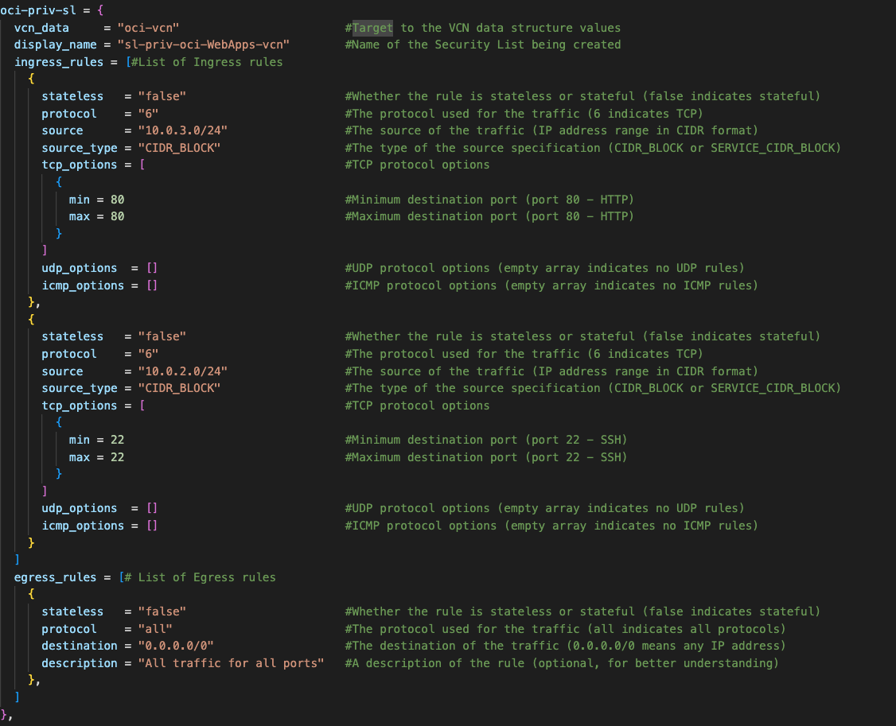

# Setting up Highly Available and Secure Infrastructure with Terraform

## Working with Networking on Terraform

### Introduction

This hands-on lab walks goes through the process of setting up Networking Infrastructure as code using Terraform on Oracle Cloud Infrastructure(OCI). In this lab, you will learn how to harness the power of Terraform to define and provision your OCI networking resources programmatically. By leveraging the OCI Terraform environment provided in the previous lab, you will be able to create a variety of networking resources, just as you would in the OCI console, but in a more automated and repeatable manner.

Throughout the lab, you will be guided through multiple tasks that demonstrate how to create various networking components, such as Virtual Cloud Networks(VCNs), Route Tables and Load Balancers. By the end of this lab, you will have gained practical experience in utilizing Terraform to design and deploy OCI networking resources, understanding how to input the necessary parameters that mirror those found in the OCI console.

Estimated Time: 1 hour and 30 minutes

### Objectives

In this lab, you will:
* Create a VCN with private and public subnets
* Create Security Lists for the VCN's subnets
* Create Gateways and Route tables for the VCN
* Create a Load Balancer 
* Create a Network Security Group

## Task 1: Creating a VCN in Terraform

In Terraform, managing input variables is a critical aspect of building flexible and reusable infrastructure configurations. One of the ways to provide values to variables in a Terraform configuration is by using the terraform.tfvars file. The .tfvars extension stands for Terraform Variables.

The terrafrom.tfvars file allows you to define and assign values to variables separately from the main configuration files. This seperation helps keep sensitive infromation out of the main configuration files, making it easier to manage and share the code infrastructure. 

**1. Open terraform.tfvars**

Open the terrafrom.tfvars file in the Terraform environment provided in the prevoius lab.  


The file contains maps of data structures containing several attributes for configuring resources on OCI. These maps, structured as data structures, facilitate the definition of complex configurations with ease. Each map corresponds to a specific OCI resource and contains a set of key-value pairs representing various resource properties.

**2. Compartment OCID**

In the terrafrom.tfvars file, navigate to the compartment\_ids variable block. Copy the comp-ocid variable string below and paste it in the compartment\_ids variable block. Replace the string value with the compartment OCID gathered in the previous lab. 

```
<copy>
comp-ocid = "&lt;replace-compartment-ocid-here&gt;" 
</copy>
```

The compartment\_ids block holds the compartment OCID in the Terrafrom Environment. This OCID serves as the compartment location in which all resources will be created on OCI. Each resource's data structure reaches out for the compartment OCID, recognizing it by the identifier comp-ocid. This connection ensures that every resource we create will deploy within the intended compartment


**3. Creating VCN**

In the terrafrom.tfvars file, navigate to the vcn\_params data structure. Copy the variable strings below and paste it into the vcn\_params data block. 

```
<copy>
compartment_data = "comp-ocid" 
display_name     = "&lt;replace-vcn-name-here&gt" 
vcn_cidr         = "&lt;replace-vcn-cidr-here&gt"
dns_label        = "&lt;replace-vcn-dnslabel-here&gt"
</copy>
```

Replace the following string values to the respective variables in the vcn\_params data block.

* display_name = oci-WebApps-vcn
* vcn_cidr = 10.0.0.0/16
* dns_label = ociwebappsvcn

The display\_name variable provides the VCN with a name that will be displayed on the OCI console. The vcn\_cidr variable assigns a specific Classless Inter-Domain Routing (CIDR) block to the VCN, defining its IP address range and subnetting. While the dns\_label variable gives a DNS label to the VCN, which serves as a basis for generating the VNC's DNS Domain Name. In the VCN data block you can also find that the compartment\_data attribute calls upon the comp-ocid variable, housing the compartment OCID for the targeted OCI compartment where the VCN will be provisioned. These atrributes form the backbone of the VCN configuration, providing Terraform with the required information needed to orchestrate and create the VCN on an OCI environment.


**Step 4**

In the terrafrom.tfvars file, navigate to the subnet\_params data structure. In the data structure there are three different data blocks that are used to provide attributes to create subnets for the VCN. The next step consist of creating private and public subnets for the VCN being created in Terraform. For this VCN you will be creating one private subnet and two public subnets. 

The first subnet being created is a Private subnet. In the subnet\_params data structure. Copy the variable strings below and paste it into the oci-priv-subnet data block. 

```
<copy>
vcn_data          = "oci-vcn"
sl_data           = "oci-priv-sl"
rt_data           = "oci-priv-rt"
display_name      = "<replace-private-subnet-name-here>"
cidr_block        = "<replace-private-subnet-cidr-here>"
dns_label         = "<replace-private-subnet-dnslabel-here>"
</copy>
```

Replace the following for each varaible in the oci-priv-subnet data block.

* display_name = priv-subnet-oci-WebApps-vcn
* vcn_cidr = 10.0.1.0/24
* dns_label = privsubdnsWeb

The display\_name variable provides the VCN with a name that will be displayed on the OCI console. The vcn\_cidr variable assigns a specific Classless Inter-Domain Routing (CIDR) block to the VCN, defining its IP address range and subnetting. While the dns\_label variable gives a DNS label to the VCN, which serves as a basis for generating the VNC's DNS Domain Name. In the VCN data block you can also find that the compartment\_data attribute calls upon the comp-ocid variable, housing the compartment OCID for the targeted OCI compartment where the VCN will be provisioned. These atrributes form the backbone of the VCN configuration, providing Terraform with the required information needed to orchestrate and create the VCN on an OCI environment.


```
<copy>
vcn_data          = "oci-vcn"
sl_data           = "oci-priv-sl"
rt_data           = "oci-priv-rt"
display_name      = "<replace-private01-subnet-name-here>"
cidr_block        = "<replace-private01-subnet-cidr-here>"
dns_label         = "<replace-private01-subnet-dnslabel-here>"
</copy>
```

Replace the following for each varaible in the oci-pub-subnet-01 data structure within subnet_params.

* display_name = pub-subnet-oci-WebLB-vcn
* vcn_cidr = 10.0.3.0/24
* dns_label = pubsubdnsLB


```
<copy>
vcn_data          = "oci-vcn"
sl_data           = "oci-priv-sl"
rt_data           = "oci-priv-rt"
display_name      = "<replace-private02-subnet-name-here>"
cidr_block        = "<replace-private02-subnet-cidr-here>"
dns_label         = "<replace-private02-subnet-dnslabel-here>"
</copy>
```

Replace the following for each varaible in the oci-pub-subnet-02 data structure within subnet_params.

* display_name = pub-subnet-oci-WebBastion-vcn
* vcn_cidr = 10.0.2.0/24
* dns_label = pubsubdnsBas


You have now created a VCN with pirvate and public subnets in the Terraform environment.

## Task 2: Creating Secuirty Lists in Terraform for Private and Public subnets.

**Step 1** 

In the terrafrom.tfvars file, navigate to the sl_params data structure. Within the sl_params you will see there is combination of data structures that create ingress and egress rules for the private and public subnets created in the previous task.

```
<copy>
stateless   = "<replace-true-or-false-here>"                      
protocol    = "<replace-traffic-protocol-here>"                          
source      = "<replace-traffic-source-here>"                
source_type = "<replace-source-type-here>"                 
tcp_options = [                            
    {
        min = <replace-min-destination-port-here>                              
        max = <replace-max-destination-port-here>                             
    }
]
udp_options  = []                           
icmp_options = []
</copy>
```

* stateless   = false                    
* protocol    = 6                          
* source      = 10.0.2.0/24                
* source\_type = CIDR_BLOCK
* min = 22
* max = 22                 

```
<copy>
stateless   = "<replace-true-or-false-here>"                      
protocol    = "<replace-traffic-protocol-here>"                          
source      = "<replace-traffic-source-here>"                
source_type = "<replace-source-type-here>"                 
tcp_options = [                            
    {
        min = <replace-min-destination-port-here>                              
        max = <replace-max-destination-port-here>                             
    }
]
udp_options  = []                           
icmp_options = []
</copy>
```

* stateless   = false                    
* protocol    = 6                          
* source      = 10.0.3.0/24                
* source\_type = CIDR_BLOCK
* min = 80
* max = 80  

```
<copy>
stateless   = "<replace-true-or-false-here>"                      
protocol    = "<replace-traffic-protocol-here>"                       
destination = "<replace-traffic-destination-here>"                   
description = "<replace-rule-description-here>"  
</copy>
```

* stateless   = false                    
* protocol    = all    
* destination = 0.0.0.0/0
* description = All traffic for all ports



```
<copy>
stateless   = "<replace-true-or-false-here>"                      
protocol    = "<replace-traffic-protocol-here>"                          
source      = "<replace-traffic-source-here>"                
source_type = "<replace-source-type-here>"                 
tcp_options = [                            
    {
        min = <replace-min-destination-port-here>                              
        max = <replace-max-destination-port-here>                             
    }
]
udp_options  = []                           
icmp_options = []
</copy>
```

* stateless   = false                    
* protocol    = 6                          
* source      = 10.0.3.0/24               
* source\_type = CIDR_BLOCK
* min = 22
* max = 22                 


```
<copy>
stateless   = "<replace-true-or-false-here>"                      
protocol    = "<replace-traffic-protocol-here>"                       
destination = "<replace-traffic-destination-here>"                   
description = "<replace-rule-description-here>"  
</copy>
```

* stateless   = false                    
* protocol    = all    
* destination = 0.0.0.0/0
* description = All traffic for all ports


```
<copy>
stateless   = "<replace-true-or-false-here>"                      
protocol    = "<replace-traffic-protocol-here>"                          
source      = "<replace-traffic-source-here>"                
source_type = "<replace-source-type-here>"                 
tcp_options = [                            
    {
        min = <replace-min-destination-port-here>                              
        max = <replace-max-destination-port-here>                             
    }
]
udp_options  = []                           
icmp_options = []
</copy>
```

* stateless   = false                    
* protocol    = 6                          
* source      = 0.0.0.0/0                
* source\_type = CIDR_BLOCK
* min = 22
* max = 22                 


```
<copy>
stateless   = "<replace-true-or-false-here>"                      
protocol    = "<replace-traffic-protocol-here>"                       
destination = "<replace-traffic-destination-here>"                   
description = "<replace-rule-description-here>"  
</copy>
```

* stateless   = false                    
* protocol    = all    
* destination = 0.0.0.0/0
* description = All traffic for all ports


## Task 3: Creating Route tables and Gateways in Terraform for Private and Public subnets.

**Step 1**

```
<copy>
vcn_data     = "oci-vcn"                          
display_name = "<replace-igw-name-here>" 
</copy>
```

* display_name = internet-gateway-oci-WebApps-vcn


```
<copy>
vcn_data     = "oci-vcn"              
display_name = "<replace-ngw-name-here>"
</copy>
```

* display_name = ngw-oci-WebApps-vcn


```
<copy>
vcn_data     = "oci-vcn"                                      
display_name = "<replace-sgw-name-here>"              
service_name = "<replace-sgw-region-service-here>"
</copy>
```

* display_name = service-gateway-oci-WebApps-vcn
* service_name = All PHX Services In Oracle Services Network


```
<copy>
destination = <replace-traffic-destination-here>          
use_igw     = <replace-igw-true-or-false-here>        
igw_data    = <replace-igw-data-structure-here>         
use_sgw     = <replace-sgw-true-or-false-here>         
sgw_data    = <replace-sgw-data-structure-here>   
ngw_data    = <replace-ngw-data-structure-here>
</copy>
```

* destination = null
* use_igw     = false
* igw_name    = null
* use_sgw     = true
* sgw_name    = oci-sgw
* ngw_name    = null

```
<copy>
destination = <replace-traffic-destination-here>          
use_igw     = <replace-igw-true-or-false-here>        
igw_data    = <replace-igw-data-structure-here>         
use_sgw     = <replace-sgw-true-or-false-here>         
sgw_data    = <replace-sgw-data-structure-here>   
ngw_data    = <replace-ngw-data-structure-here> 
</copy>
```

* destination = "0.0.0.0/0"
* use_igw     = false
* igw_name    = null
* use_sgw     = false
* sgw_name    = null
* ngw_name    = oci-ngw


```
<copy>
destination = <replace-traffic-destination-here>          
use_igw     = <replace-igw-true-or-false-here>        
igw_data    = <replace-igw-data-structure-here>         
use_sgw     = <replace-sgw-true-or-false-here>         
sgw_data    = <replace-sgw-data-structure-here>   
ngw_data    = <replace-ngw-data-structure-here>   
</copy>
```

* destination = "0.0.0.0/0"
* use_igw     = true
* igw_name    = oci-ig
* use_sgw     = false
* sgw_name    = null
* ngw_name    = null


## Task 4: Creating a Loadbalancer in Terraform.

```
<copy>
compartment_data = "comp-ocid"         
subnet_data      = "oci-pub-subnet-01" 
nsg_data         = "oci-nsg"           
display_name     = "<replace-lb-name-here>"    
shape            = "<replace-lb-shape-here>"          
defaultmax       = <replace-connection-max>                
defaultmin       = <replace-connection-min>    
</copy>
```

* display_name = oci-WebApps-lb
* shape = flexible
* defaultmax = 100
* defaultmin = 10


```
<copy>
lb_data     = "oci-lb"                
backend_data = "oci-lb-backendset"    
display_name = "<replace-listener-name-here>"      
port         = "<replace-listener-port-here>"                  
protocol     = "<replace-listener-protocol-here>"   
</copy>
```

* display_name = oci-WebLB-listener
* port = 80
* protocol = HTTP


```
<copy>
lb_data     = "oci-lb"             
display_name = "<replace-backendset-name-here>"  
policy       = "<replace-traffic-policy-here>"   
</copy>
```

* display_name = oci-lb-backendset
* policy = ROUND_ROBIN


```
<copy>
lb_data   = "oci-lb"               
backend_data = "oci-lb-backendset" 
webserver_name = "<replace-webserver1-name-here>"     
backup       = "<replace-backup-true-or-false-here>"             
drain        = "<replace-drain-true-or-false-here>"              
offline      = "<replace-offline-true-or-false-here>"            
port         = "<replace-backend-port-here>"                
weight       = "<replace-backend-weight-here>"   
</copy>
```

* webserver_name = Webserver01
* backup = false         
* drain = false                 
* offline = false          
* port = 80                
* weight = 1     

```
<copy>
lb_data   = "oci-lb"               
backend_data = "oci-lb-backendset" 
webserver_name = "<replace-webserver2-name-here>"     
backup       = "<replace-backup-true-or-false-here>"             
drain        = "<replace-drain-true-or-false-here>"              
offline      = "<replace-offline-true-or-false-here>"            
port         = "<replace-backend-port-here>"                
weight       = "<replace-backend-weight-here>"   
</copy>
```

* webserver_name = Webserver02
* backup = false         
* drain = false                 
* offline = false          
* port = 80                
* weight = 1

```
<copy>
lb_data   = "oci-lb"               
backend_data = "oci-lb-backendset" 
webserver_name = "<replace-webserver3-name-here>"     
backup       = "<replace-backup-true-or-false-here>"             
drain        = "<replace-drain-true-or-false-here>"              
offline      = "<replace-offline-true-or-false-here>"            
port         = "<replace-backend-port-here>"                
weight       = "<replace-backend-weight-here>"   
</copy>
```

* webserver_name = Webserver03
* backup = false         
* drain = false                 
* offline = false          
* port = 80                
* weight = 1


## Task 5: Creating a Network Security Group in Terraform.

```
<copy>
vcn_data     = "oci-vcn" 
display_name = "<replace-nsg-name-here>"    
</copy>
```

* display_name = nsg-oci-WebApps-vcn


```
<copy>
nsg_data     = "oci-nsg"               
direction    = "<replace-traffic-direction-here>"               
protocol     = "<replace-traffic-protocol-here>"                    
destination  = "<replace-traffic-destination-here>"                    
source       = "<replace-traffic-source-here>"             
stateless    = "<replace-true-or-false-here>"              
source_type  = "<replace-source-type-here>"    
</copy>
```

* direction = INGRESS             
* protocol = 6                     
* destination = 80                   
* source = 0.0.0.0/0            
* stateless = false              
* source\_type = CIDR_BLOCK


## Learn More

*(optional - include links to docs, white papers, blogs, etc)*

* [URL text 1](http://docs.oracle.com)
* [URL text 2](http://docs.oracle.com)

## Acknowledgements
* **Author** - <Name, Title, Group>
* **Contributors** -  <Name, Group> -- optional
* **Last Updated By/Date** - <Name, Month Year>
