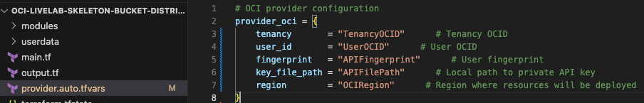
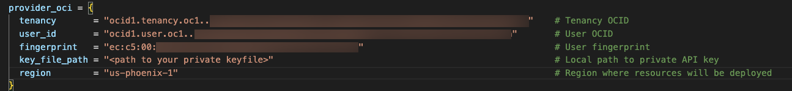

# Set up Highly Available and Secure Infrastructure with Terraform on OCI

## Set up your Tenancy

This lab walks you through how to set up the OCI provider in the Terraform. 

Estimated Time: 30 minutes

### Prerequisites

This lab assumes you have:
* An Oracle account
* Familiarity with Networking is desirable, but not required
* Some understanding of cloud, networking, and Terraform
* Familiarity with Oracle Cloud Infrastructure (OCI) is helpful

### Objectives

In this lab, you will:
* Learn how to use/setup Terraform

## Task 1: Defining the OCI Provider in the Terraform
The Terraform main.tf file is the main entry point for the Terraform configuration. It contains the core infrastructure definitions for the Terraform environment. 

The first definition in this file is the provider. In Terraform, a "provider" is a plugin that allows Terraform to interact with a specific cloud or infrastructure platform to create, manage, and delete resources. The provider is an essential component as it enables Terraform to abstract the underlying APIs of various cloud providers. In this lab we will be defining the provider using the main.tf and provider.auto.tfvars files. 

1. Open the provider.auto.tfvars file. In the file you will see a Terraform configuration block that defines the necessary configurations to authenticate and interact with the Oracle Cloud Infrastructure APIs.

 

2. In the file replace the tenancy, and USERID values with the corresponding OCIDs gathered in the previous labs. As well as replacing the fingerprint string gathered when generating the API key on the OCI console. When generating the API key on OCI console you downloaded a public and private file into your local machine. In the key-file-path variable replace the value with the path to where you stored the private file for the API key. The last variable is region, which is where you identify the region where the resources will be created. Replace the value with the region id for example the Phoenix region id will be "us-phoenix-1".

 

3. Open the main.tf file. In the file we can see that there is a provider configuration block similar to the one in provider.auto.tfvars. However there is no need to edit this block as it is requesting the values from the configuration block that was just edited in the previous step.

 

You may now **proceed to the next lab**

## Acknowledgements
* **Author** - David Ortega, Cloud Engineer
* **Contributors** - Germain Vargas, Cloud Engineer
* **Last Updated By/Date** - David Ortega, August 2023
