# Create Travel Advisor Chatbot

## About this workshop

In this lab, we'll provision the Oracle Digital Assistant [ODA] from Oracle Cloud Infrastructure services.
 
Estimated Time: 20 minutes

### Objectives

To set up the Oracle Digital Assistant on the OCI tenancy, you will:

* Oracle Digital Assistant for natural language processing(NLP), natural language understanding (NLU) 
* Provision Oracle Digital Assistant from OCI services
* Create Oracle Digital Assistant Skill 
* Adding Knowledge document for Frequently asked questions (FAQs)
* Train the Oracle Digital Assistant Model
* Preview the Model and Skill
* Add Auto Complete Suggestion and Utterances.
* Create Web Channel for a Skill

### Prerequisites

* A user with access to provision & manage Core OCI services like Oracle Digital Assistant

### About Oracle Digital Assistant
  
Oracle Digital Assistant delivers a complete AI platform to create conversational experiences for business applications through text, chat, and voice interfaces.

*Conversational AI*

Natural language understanding and machine learning
Oracle Digital Assistant applies deep semantic parsing using natural language processing, natural language understanding (NLU), and custom algorithms to understand common conversations to derive accurate intent and context.

*AI-powered voice*

Eliminate reliance on third-party offerings with Oracle’s AI-powered voice. Users can communicate with their business application using voice commands with an assistant that understands their business-specific vocabulary and enables naturally expressive interactions. Give your customers more control of their data by providing end-to-end security and compliance with privacy standards, such as PII and GDPR.

*Analytics and insights*

Gain customer insights through built-in analytics that identify conversational bottlenecks and usage patterns and make data-driven decisions that continually improve the user experience.

## Task 1: Log into OCI

1. Login into OCI

    To setup environment, you need OCI administrator's privileges. If you've got these privileges, login into OCI at [cloud.oracle.com](https://www.oracle.com/cloud/sign-in.html). the below image indicates SSO Login as an administrative user. If you have administrative previleges and complete access over a tenancy then you need not create any of the policies below steps.

    

2. If you do not have administrative privileges into tenancy, you might have to login as federated user, that is the user created by the administrator

    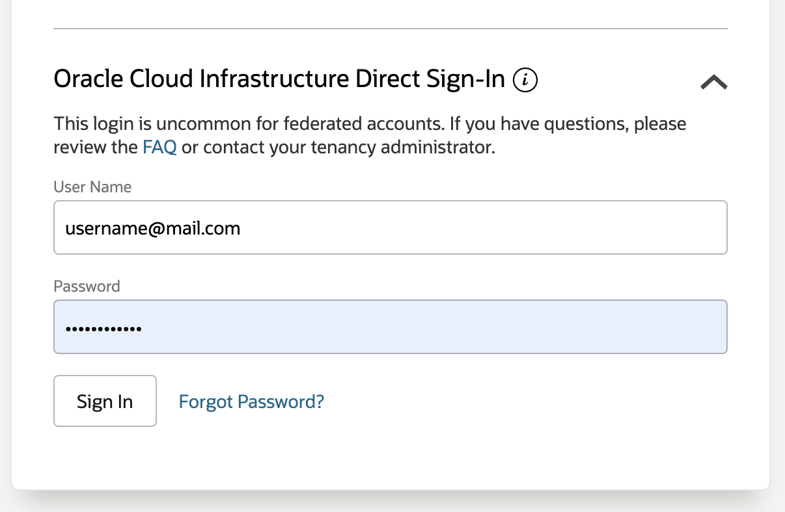

    In case you haven't got OCI administrator's privileges, you should ask your OCI administrator to perform the rest of the tasks in this lab.

## Task 2: Provision Oracle Digital Assistant from OCI services
 
1.  On the Oracle Cloud Infrastructure Console Home page, click the Navigation Menu in the upper-left corner, select **Analytics & AI**, and then select **Digital Assistant**.

  

2.  On the OCI Digital Assistants page,  click on the **Create digital assistant instance** button

    
    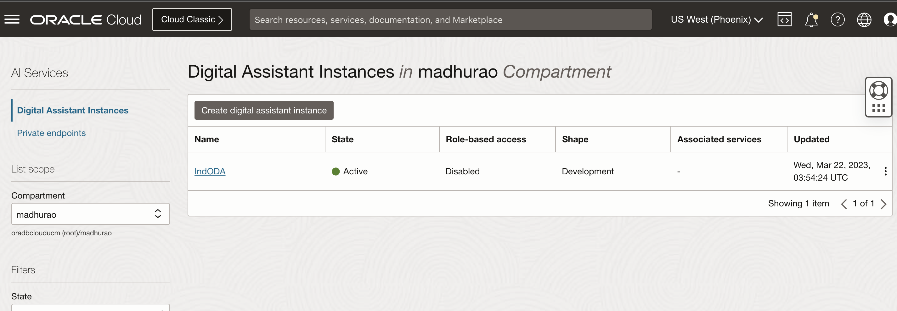

3.	Select the  compartment where you want to create the digital assistant, provide a name,  description for the digital assistant and select development as the shape and click **Create** button.
  
4.  The Oracle Digital Assistant is being provisioned and below screen shows the current status and the final status of the ODA provision.
 
     The Oracle Digital Assistant is provisioned, click on **Service console** button.
  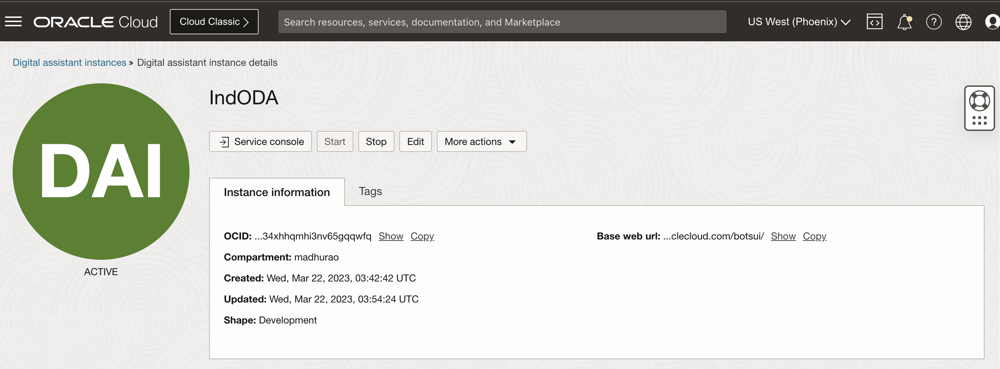

  In the sign-in box, provide the **Tenancy**  name and click on **Continue**

   and Login as Options in Task 1

## Task 3:  Create Oracle Digital Assistant Skill

1. After Logging into Oracle Digital Assistant, click on left navigation, select Development, 

  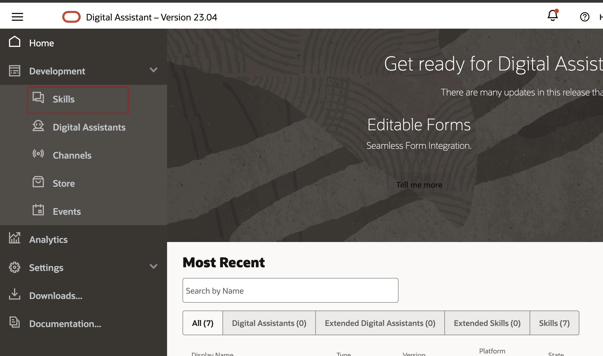

2. Click on **Skills**, click on create **New Skill**

  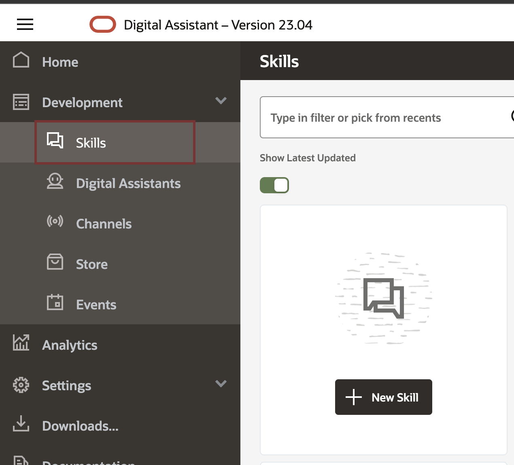

3. Type in display name, select **YAML** as Dialog mode, this gives ability to update YAML code manually to control the flow of ODA. if you choose Visual then you would not be able edit the flow at code level.

  Click on **Create** button.

  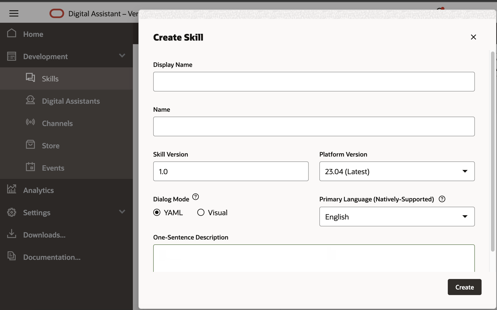

## Task 4:  Adding Knowledge document for Frequently asked questions (FAQs)

1. Click on Add knowledge document icon. 

  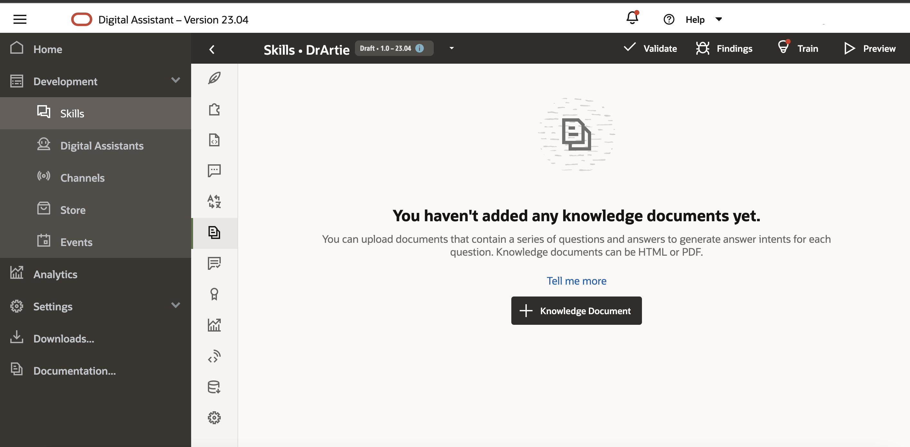

2. Provide the URL for FAQs or upload a PDF file with Questions and Answers or a HTML page.

  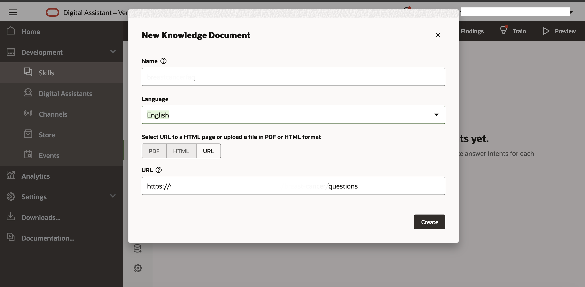

  This will start creation of [ODA Intents](https://docs.oracle.com/en/cloud/paas/digital-assistant/use-chatbot/intents1.html) automatically from FAQ URL. 

3. Review the intents.

  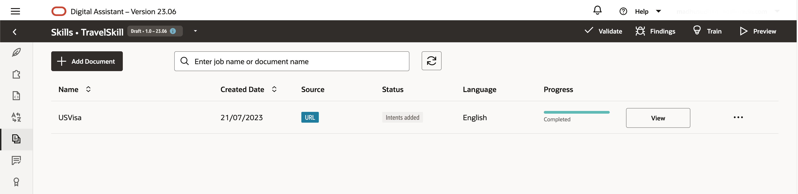

  Review new intents and edit if required, click on  **Add Intents to Skill** button

  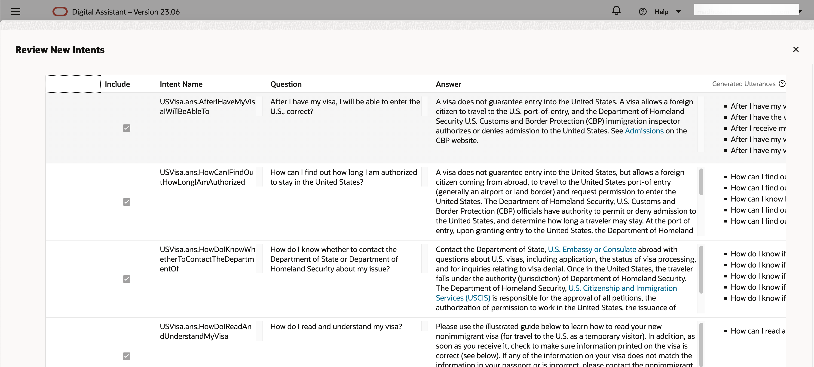

1. Click on **Yes** button.
 
## Task 5:  Train the Oracle Digital Assistant Model
 
1. Click on **Train** button, 

  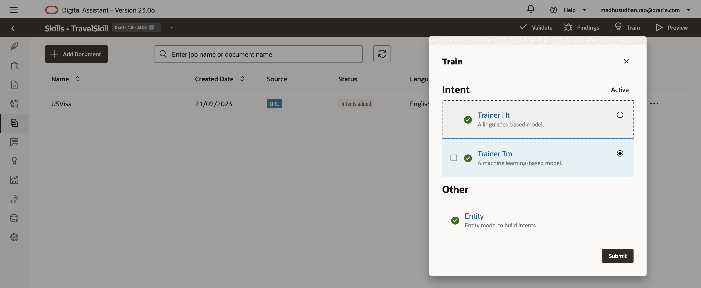

2. Select **Linguistic based Model**, click **Submit** button 

3. Select **Machine learning based Model**, click **Submit** button
 
## Task 6:  Preview the Model and Skill

1. Click on **Preview** icon in the top navigation next to **Train** button, This will open intent test area where you can provide input and review the output that should identify the intent and deliver the answer.On the right side under Intent/Q&A review the flow especially the one with 100% scoring.

  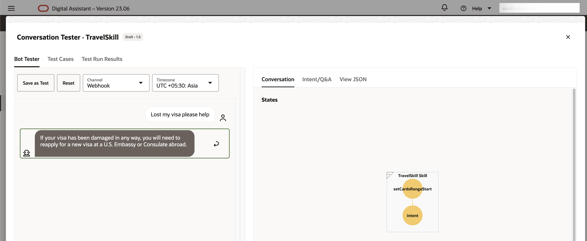 

2. Change the Question and see the response back.
 

## Task 7:  Add Auto Complete Suggestion and Utterances.

1. Under the Intent, you can also add **Auto Complete Suggestion**. where user need not type the entire question to get his question intent and get the corresponding answer.

  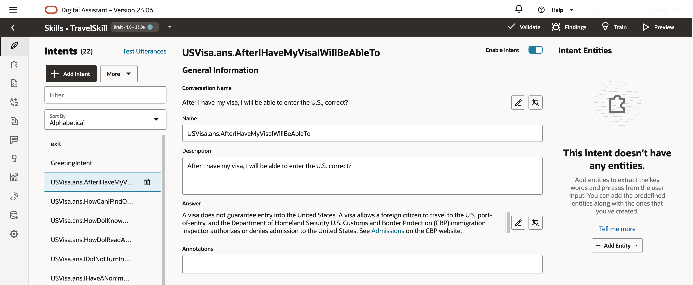

2. Under the Intent, review **Utterances**, same question can be asked in different ways, this is where we capture different questions that link to same answer or have a common intent.

  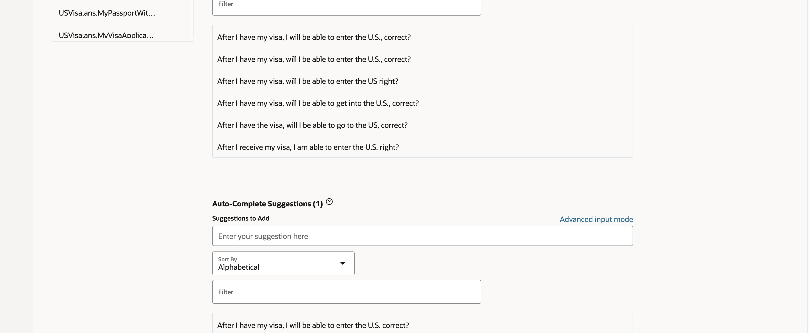

## Task 8: Create Web Channel for a Skill

1. Click on the left navigation menu, Under **Development** select **Channels**, Click on **Add Channel** button

  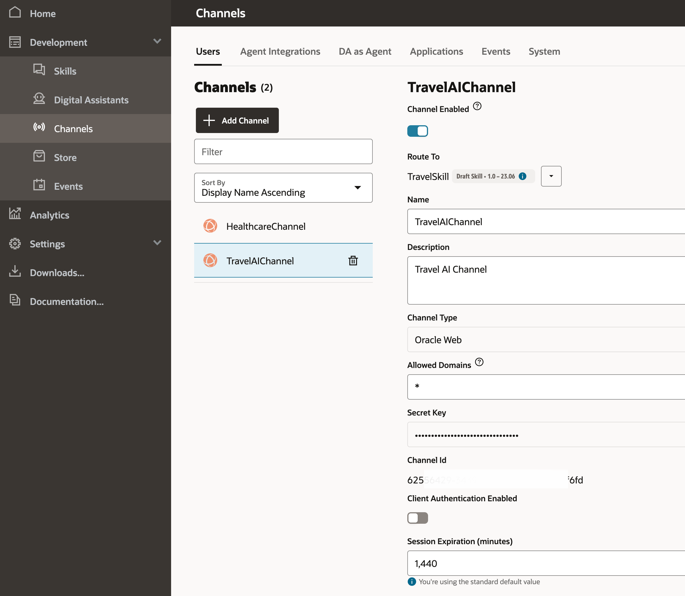

2. Provide **channel name**, select the skill which we just created under **Route To** option, 

3. Channel type should be **Oracle Web**, Allowed domains can be * or you can specify any particular domain which will act as host to this channel. This will generate **secret** and **channel id**
 
You may now **proceed to the next lab.**

## Acknowledgements
 
* **Architect, Author and Developer** - [Madhusudhan Rao B M](https://www.linkedin.com/in/madhusudhanraobm/), Principal Product Manager, Oracle Database
* **Last Updated By/Date** - Dec 4th, 2023.