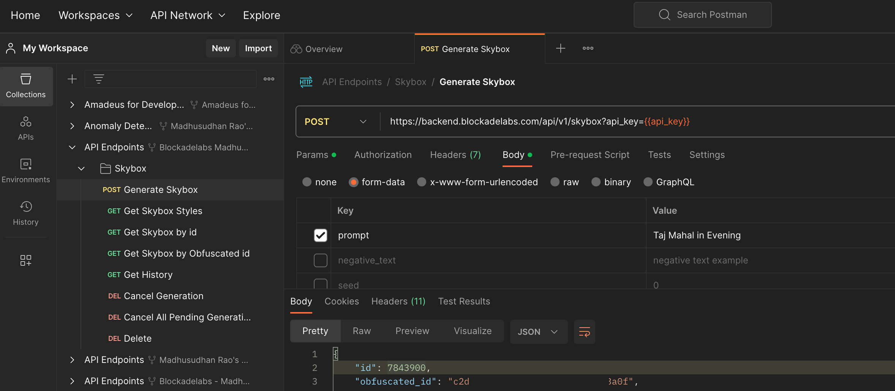
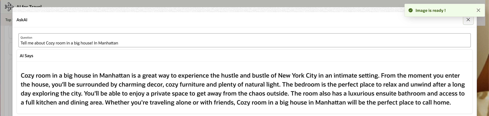

# Generative AI (Image)

## Introduction

In this lab, you will learn how to Generate AI Images using Blockade Labs REST APIs and show that in a panoramic view.

Estimated Lab Time: 45 minutes

### Objectives

In this lab, you will:

- Generate AI Images using Blockade Labs REST APIs. 

### Prerequisites:

- Completed Previous Labs and have access to Oracle APEX application.
- Knowledge of Oracle APEX and PL/SQL 
- Blockade Labs API Key Access (please read their terms and conditions for using API Keys)

### About Blockade Labs 

Please read more about [Blockadelabs](https://www.blockadelabs.com/). You can view their Image Generation AI at [SkyBox AI](https://skybox.blockadelabs.com/).
  
## Task 1: Sign up and Sign in to Blockade Labs 

1. Sign up, Sign in and Get API Keys from Blockade Labs, read their [API documentation](https://api-documentation.blockadelabs.com/api/skybox.html)
2. Please read their terms and conditions

## Task 2: Understand Request and Response from POSTMAN client

1. Once you have API Keys, you can use [POSTMAN](https://api-documentation.blockadelabs.com/api/postman-collection.html) to test your keys
2. There are essentially three steps while you plan to generate an Image
   
   * Create a Job that Generates an Image based on User Input prompt text and other input parameters provided
   * Get the ID of your generation. It can be used to track generation progress or to cancel the generation
   * Once the Generation is completed, you can get the image thumbnail and full image URL
 
3. POST at https://backend.blockadelabs.com/api/v1/skybox?api_key={{api_key}} and wait for few seconds for Job to get completed.
   
   

4. GET at https://backend.blockadelabs.com/api/v1/imagine/requests/{{id}}?api_key={{api_key}}
   
     

5. View JSON Response

    ```json
        <copy> 
        {
            "request": {
                "id": 7843900,
                "obfuscated_id": "c2d3cb07e8********3a0f",
                "user_id": 2008,
                "title": "World #7843900",
                "prompt": "Taj Mahal in Evening",
                "seed": 206377658,
                "negative_text": null,
                "username": "your-email",
                "status": "complete",
                "queue_position": 0,
                "file_url": "https://hostname/images/imagine/vr360-taj-mahal-evening-equirectangular-panoramic-vr360_7843900.jpg?ver=1",
                "thumb_url": "https://hostname/thumbs/imagine/thumb_vr360-taj-mahal-evening-equirectangular-panoramic-vr360_7843900.jpg?ver=1",
                "depth_map_url": "",
                "remix_imagine_id": null,
                "remix_obfuscated_id": null,
                "isMyFavorite": false,
                "created_at": "2023-07-25T04:24:38+00:00",
                "updated_at": "2023-07-25T04:24:57+00:00",
                "error_message": null,
                "pusher_channel": "status_update_c2d3cb07e8679472663d59dceaeb3a0f",
                "pusher_event": "status_update",
                "type": "skybox",
                "skybox_style_id": 13,
                "skybox_id": 13,
                "skybox_style_name": "Advanced (no style)",
                "skybox_name": "Advanced (no style)",
                "dispatched_at": "2023-07-25T04:24:38+00:00",
                "processing_at": "2023-07-25T04:24:40+00:00",
                "completed_at": "2023-07-25T04:24:57+00:00"
            }
        } 
        </copy>
        ```

6. View Generated Image in the browser Tab
   
   

## Task 3: Create an APEX Page

1. Create an APEX page with a list of regions and corresponding UNESCO sites. Create a Process to Generate AI Images with POST operation after the button has been submitted. Get the Response ID and set it on a hidden page item.
 
    

2. Set a wait time of a few seconds and, based on Response ID, run one more GET query to get the actual URL of Generated Image and Display the image on the page in a panoramic view on the page.

    

## Task 4: Getting Pannellum Lightweight Panorama Viewer for the Web 

1. Getting [Pannellum Lightweight Panorama Viewer for the Web](https://pannellum.org/) on your Oracle APEX Web page is simple, just create a static region with following code. 
2. Add the following html code in static APEX region
3. APEX page static regions
   
4. Html code 
    ```html
        <copy> 
            <link rel="stylesheet" href="https://cdn.jsdelivr.net/npm/pannellum@2.5.6/build/pannellum.css"/>
        <script type="text/javascript" src="https://cdn.jsdelivr.net/npm/pannellum@2.5.6/build/pannellum.js"> 
        </script>
        </copy>
        ```
5. Add the following CSS code in static APEX region to adjust styling
6. CSS Code
    ```css
        <copy> 
        #panorama {
            width: 100vw;
            height: 100vh;
            padding: 0;
            margin: 0;
        }
        * {
            padding: 0;
            margin: 0;
        }  
        .content { 
            width: 400px;
            margin: 0 auto;
            padding: 10px;
            position: absolute; right: 0; top: 0; z-index: 0;
        }
        .content video {
            width: 100%;
            display: block;
        }
        .content:before {
            content: '';
            position: absolute;
            background: rgba(0, 0, 0, 0.5);
            border-radius: 5px;
            top: 0;
            right: 0;
            bottom: 0;
            left: 0;
        } 
        </copy>
        ```

## Task 5: PL/SQL code to bring Generative AI Image into your Application.

1. Create a PL/SQL code to create Job to generate image and get response id
2. PL/SQL code
    ```sql
    <copy> 
        declare
        l_request  clob;
        l_response clob;
        l_endpoint varchar2 (2000);
        l_reqid varchar2 (100) := 100000;
        l_AI_TEXT varchar2 (500) := :P18_INPUT;
        l_style varchar2 (30) := :P18_STYLE;
        l_NEGETIVE_TEXT varchar2 (500) := 'blurry, lowres, text, error, worst quality, low quality, bad quality';
    
        
        CURSOR C1  IS 
        SELECT jt.* 
        FROM   JSON_TABLE(l_response, '$'  
                COLUMNS (label1      VARCHAR2(100)  PATH '$.id' )) jt; 

    begin
    
        l_endpoint := 'https://backend.blockadelabs.com/api/v1/skybox?api_key=your-blockade-labs-key'; 
        -- Set HTTP Request Headers
        apex_web_service.g_request_headers.delete;

        apex_web_service.g_request_headers(1).name  := q'#Content-Type#';
        apex_web_service.g_request_headers(1).value := q'#application/json#';
        
        apex_json.initialize_clob_output(DBMS_LOB.CALL, true, 2);
        apex_json.open_object();
        apex_json.write('api_key',    'your-blockade-labs-key');
        apex_json.write('generator',  'stable-skybox');
        apex_json.write('prompt', l_AI_TEXT);
        apex_json.write('skybox_style_id', l_style); 
        apex_json.write('negative_text', l_NEGETIVE_TEXT );  
        apex_json.close_object; 

        htp.p('Generating AI Image ' ); 

        l_response := apex_web_service.make_rest_request(
            p_url         => l_endpoint,
            p_http_method => 'POST',
            p_body        => apex_json.get_clob_output );
    
        For row_1 In C1 Loop
            l_reqid := row_1.label1;
            Htp.p(  'ID: '|| l_reqid );  
        End Loop;
        -- set the request id of this image generation into a variable.
        :P18_REQID := l_reqid;
     
        apex_application.g_print_success_message := 'Image is getting generated !'; 

        DBMS_LOCK.sleep(20);
    
        apex_application.g_print_success_message := 'Image is ready !';
        
        if apex_web_service.g_status_code not between 200 and 299 then
            raise_application_error(-20000, 'HTTP-'|| apex_web_service.g_status_code);
        end if;
    end;   
    </copy>
    ```
 
4. Create a PL/SQL code to get full image by passing the response Id  

5. PL/SQL code 
    
    ```sql
    <copy> 
        declare
        l_request  clob;
        l_response clob;
        l_endpoint varchar2 (2000);
        l_reqid varchar2 (100) := :P18_REQID; 
        l_file_url varchar2(1000) := 'Pending';
        l_blob  blob;
        l_body_html      CLOB;
        l_sd varchar2(4000) := 'Unesco'; 
        l_text varchar2(500) := :P18_TEXT;

    

        CURSOR C1  IS 
        SELECT jt.* 
        FROM   JSON_TABLE(l_response, '$' 
                COLUMNS (file_url VARCHAR2(2000)  PATH '$.request[0].file_url' )) jt; 

        begin
        
        l_endpoint := 'https://backend.blockadelabs.com/api/v1/imagine/requests/'||l_reqid||'?api_key=your-blockade-labs-key';
        
    
            
        apex_web_service.g_request_headers.delete;

        apex_web_service.g_request_headers(1).name  := q'#Content-Type#';
        apex_web_service.g_request_headers(1).value := q'#application/json#';
        
        apex_json.initialize_clob_output(DBMS_LOB.CALL, true, 2);
        apex_json.open_object(); 
        apex_json.write('api_key',      'your-blockade-labs-key');
        apex_json.write('id',  l_reqid);
        apex_json.write('user_id', 2008); 
        apex_json.close_object;  

        l_response := apex_web_service.make_rest_request(
            p_url         => l_endpoint,
            p_http_method => 'GET' );
    
        For row_1 In C1 Loop
            l_file_url := row_1.file_url; 
        End Loop;
            
        
        if  l_file_url != 'Pending' then  

            l_blob := apex_web_service.make_rest_request_b( 
                p_http_method  => 'GET', 
                p_url          => l_file_url
            );
 
            ------- Display Panorama Image 360 degree view of a site.
            l_body_html := l_body_html || ' 
            <div id="panorama"> 
                </div> 
            <script>
                pannellum.viewer("panorama", {   
                    "default": {
                        "firstScene": "circle",
                        "author": "Unesco Heritage",
                        "sceneFadeDuration": 1000,
                        "autoLoad": true
                    }, 
                    "scenes": {
                        "circle": {
                            "title": "  '||l_text||'  ",
                            "hfov": 110,
                            "pitch": -3,
                            "yaw": 117,
                            "type": "equirectangular",
                            "panorama": "'||l_file_url||'"  
                        }  
                    }
                });
                </script>  ' || utl_tcp.crlf; 

            Htp.p(l_body_html);  
        end if; 
        
        
    end;
    </copy>
    ```

## Task 6: Demo

1. Generative Text AI or Ask AI will be covered in next lab. 
2. Search for an UNESCO Site based on region and Generate AI image.

    

3. Ask AI about the UNESCO Site  

    >**Note:** We will talk about how to Generate AI text in our next lab

    

4. Search for another UNESCO Site based on region and Generate AI image.

    

5. Search for another UNESCO Site based on region and Generate AI image

    

6. Ask AI about the UNESCO Site 

    

7. Generate AI image about accommodations available at the selected site.

    

8. Ask AI about Accommodations available at the selected site.

    
 
Congratulations on completing this lab!. You may now **proceed to the next lab**
 
## Learn More

* [Blockadelabs](https://www.blockadelabs.com/index.html) 
* [SkyBox AI](https://skybox.blockadelabs.com/)
* [Pannellum Lightweight Panorama Viewer for the Web](https://pannellum.org/)
* [Generative AI](https://en.wikipedia.org/wiki/Generative_artificial_intelligence)

## Acknowledgements

* **Architect, Author and Developer** - [Madhusudhan Rao B M](https://www.linkedin.com/in/madhusudhanraobm/), Principal Product Manager, Oracle Database
* **Last Updated By/Date** - July 28th, 2023.
