# Generative AI (Text)

## Introduction

In this lab, you will learn how to Generate AI Text using Cohere or OpenAI REST APIs and help Travelers answer their questions related to the UNESCO site or activities around that site or even about the City itself.

Estimated Lab Time: 45 minutes

### Objectives

In this lab, you will:

- Generate AI Text using Cohere REST APIs. 

### Prerequisites:

- Completed Previous Labs and have access to Oracle APEX application.
- Knowledge of Oracle APEX and PL/SQL.
- Cohere API Key access.

### About Oracle Generative AI

Cloud Infrastructure (OCI) [Generative AI](https://www.oracle.com/in/artificial-intelligence/generative-ai/large-language-models/) is a fully managed service available via API to seamlessly integrate these versatile language models into a wide range of use cases, including writing assistance, summarization, and chat.

This lab will show a hands-on approach to building AI-driven innovative applications using Oracle Generative AI services and low code Oracle APEX Applications. We will test our AI model with questions related to Neurology, Weather conditions, Writing emails, Generating Java code, Generating SQL, or even how to make mixed fruit jam. The Oracle AI Language Translation Service can easily translate these AI response texts into various languages.

Oracle Beta Programs Preview the future of OCI today: You can request access from [here](https://apexadb.oracle.com/ords/f?p=102:100) and follow that link for more details.

Assumption/Requirements: You have already installed Oracle APEX workspace and have access to OCI Generative AI service. Your Administrator has set up OCI Policies for Generative AI access, or you have Administrator privileges in your tenancy.

We will look at two options to run Generative AI.

  * Cloud console - playground
  * Oracle APEX Application 

### About Cohere

Please read about [Cohere](https://cohere.com/) and their usage terms and conditions.
 
### **Question 1:** *Things to Do at the Statue of Liberty, USA?*
  
### **Cohere Response**

  * Take a tour of the pedestal and crown. 
  * Visit the museum. Eat at one of the many nearby restaurants. 
  * Visit the gift shop. Take a walk around the island. 
  * See the statue from the water on a guided tour.
 
### **Question 2:** *What are the top 5 things to do in new york on vacation with family?*
 
### **Cohere Response**

  * Visit the Empire State Building 
  * See a Broadway show 
  * Stroll through Central Park 
  * Take a ride on the Staten Island Ferry 
  * Visit the Museum of Modern Art

## Task 1: Sign up at Cohere

1. Sign up and Sign in and [generate AI API Key](https://dashboard.cohere.ai/api-keys)  

2. Generate Cohere API Key and read API key [limitations](https://docs.cohere.com/docs/going-live)

     

## Task 2: Getting Response from Cohere

1. Review the request JSON, Call API end point at https://api.cohere.ai/v1/generate

    ```json
    <copy> 
        {  
            "model": "command",
            "prompt": "Your input text here",
            "max_tokens": 300,
            "temperature": 0.9,
            "k": 0,
            "stop_sequences": [],
            "return_likelihoods": "NONE"
    }   
    </copy>
    ```

2. Review the response JSON

    ```json
    <copy> 
        {
            "id": "2c5fd5d6-743c-4a52-****-*****",
            "generations": [
                {
                    "id": "46907fbb-1d86-40fc-****-*****",
                    "text": "\n your answer goes here  "
                }
            ],
            "prompt": "your question goes here",
            "meta": { "api_version": 
                        { 
                            "version": "1" 
                        } 
                    }
    }
    </copy>
    ```

3. PL/SQL Code to send request and get response back from Cohere, you can create an Oracle APEX Dynamic Region to display the results taking input from a page item after submitting the page. Construct PL/SQL Code block, Replace this code in the PL/SQL Dynamic content window, use [JSON_TABLE](https://docs.oracle.com/en/database/oracle/oracle-database/19/sqlrf/JSON_TABLE.html) to create a PL/SQL cursor 


     

1. Response Dynamic PL/SQL block code

    ```sql
    <copy> 
        DECLARE
    
        l_url    VARCHAR2(4000) := 'https://api.cohere.ai/v1/generate';  
        l_input VARCHAR2(4000) := :P48_INPUT;
        
            l_body   VARCHAR2(4000) := '{
                "model": "command",
                "prompt": "'||l_input||'",
                "max_tokens": 300,
                "temperature": 0.9,
                "k": 0,
                "stop_sequences": [],
                "return_likelihoods": "NONE"
                }';
            l_response_json CLOB;
            l_text VARCHAR2(4000);

        CURSOR C1  IS 
            SELECT jt.* 
            FROM   JSON_TABLE(l_response_json, '$' 
                    COLUMNS (text VARCHAR2(2000)  PATH '$.generations[0].text' )) jt; 

        BEGIN

        if l_input is not null then

        apex_web_service.g_request_headers(1).name := 'Content-Type';
            apex_web_service.g_request_headers(1).value := 'application/json';
            apex_web_service.g_request_headers(2).name := 'Authorization';
            apex_web_service.g_request_headers(2).value := 'Bearer Your-cohere-API-Key';

        l_response_json := apex_web_service.make_rest_request( 
            p_url => l_url, 
            p_http_method => 'POST', 
            p_body => l_body  
        );

        --Htp.p(l_response_json ); 

            For row_1 In C1 Loop
                l_text := row_1.text;
                    Htp.p(  l_text );  
            End Loop;

            end if;

        END;     
    </copy>
    ```
 
## Task 3: Demo

1. Login into **AI for Travel** Oracle APEX Application, Select UNESCO Site or Airport or Accommodation and Ask AI about it. 
 
2. Ask AI about an UNESCO site.
    
    

3. Ask AI about another UNESCO site.   

    

4. Ask AI about an Accommodation site and Generate AI Image

    

    
  
## Task 4: Oracle Generative AI - Playground

Optionally if you would like to use Oracle Generative AI instead of Cohere, please follow the tasks below.

1. Log in to Oracle Cloud at cloud.oracle.com, change region to US Midwest Chicago
Under left navigation select Analytics and AI, under AI Services select Generative AI.

    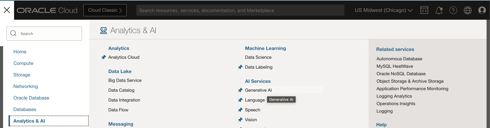

1. Click on playground in the left navigation and select the default settings ( Cohere model cohere.command v15.6), you can change the settings if required.

    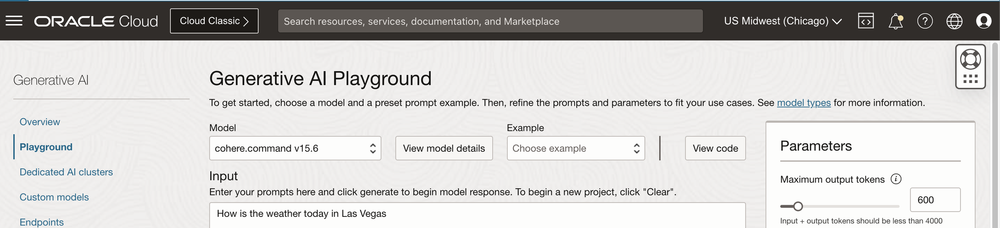
    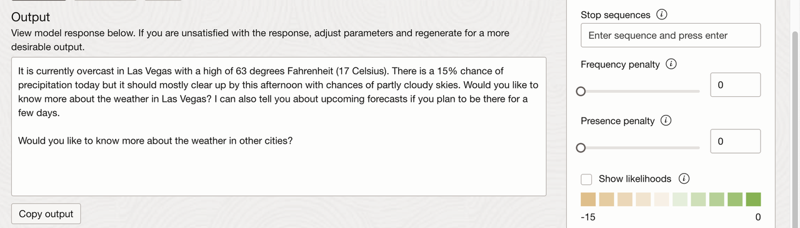

    ```
    <copy> 
    Input: How is the weather today in Las Vegas

    Output: It is currently overcast in Las Vegas with a high of 63 degrees Fahrenheit (17 Celsius). There is a 15% chance of precipitation today but it should mostly clear up by this afternoon with chances of partly cloudy skies. Would you like to know more about the weather in Las Vegas? I can also tell you about upcoming forecasts if you plan to be there for a few days.

    Would you like to know more about the weather in other cities?
    </copy>
    ```

    At this stage you can view Java or Python code in the console.

## Task 5: Oracle Generative AI with Oracle APEX

Running Generative AI Application inside Oracle APEX is a three step process.

* Create Web Credentials.
* Create Oracle APEX page 
* Create Process with PL/SQL code block.

We will see these steps in next few tasks.

## Task 6: Create Web Credentials

If you have already created web credentials then you can ignore this step, Oracle APEX Web Credentials provides a convenient and secure mechanism for storing the following types of credentials:

* Basic Authentication (Username & password)
* OAuth2 Client Credentials (Client ID & Client Secret)
* OCI Native Authentication (Access Oracle Cloud Resources, e.g., Object Storage)
* HTTP Header (The credential is added to the REST request as an HTTP Header)
* URL Query String (The credential is added to the URL of the REST request as a Query String Parameter).
  
1. In the APEX top navigation, Select App Builder, Click on Workspace Utilities

    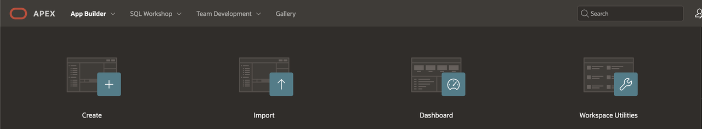

2. Select Web Credentials

    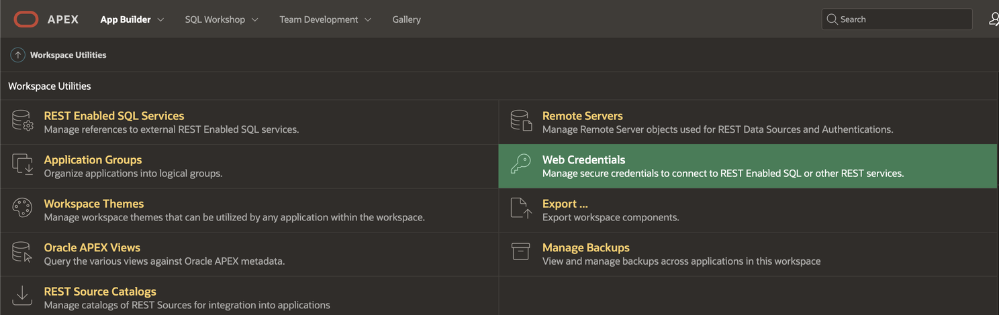

3. Click on Create

    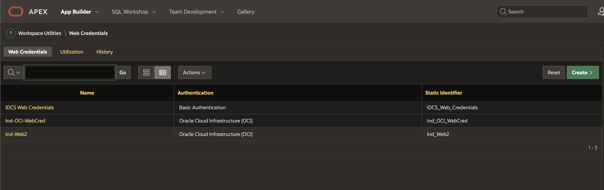

4. Provide User OCID, Tenancy OCID, Fingerprint, Private Key and Authentication type as Oracle Cloud Infrastructure. 
    
    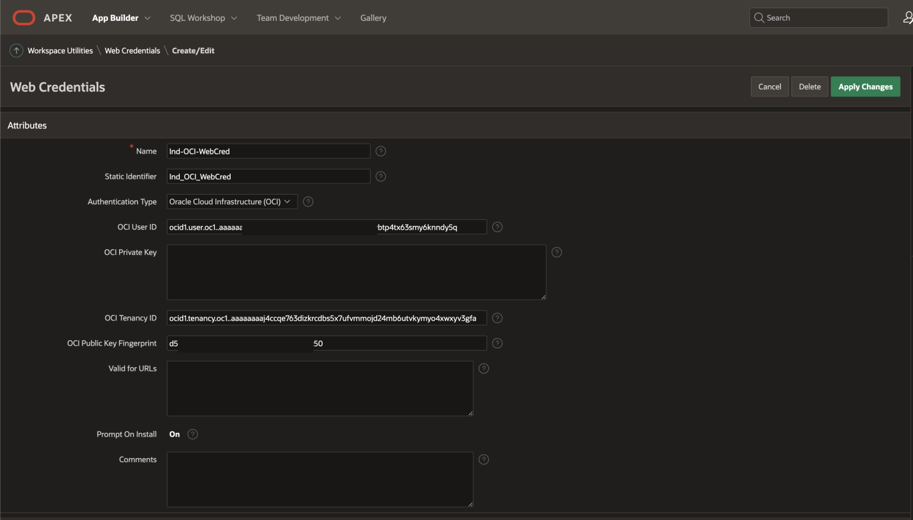

## Task 7: Create Oracle APEX page with following page items

1. This page will have the following APEX page items
   
    * AI\_INPUT -> Text field to accept user's input text
    * Button -> to call Generative AI REST Service using PL/SQL code block
    * AI\_OUTPUT -> Type Rich Text Editor to display AI response as output. under settings choose TinyMCE and format as Markdown
  
    Region and layout can be your own choice

## Task 8: PL/SQL code block process

1.  Under Processing Tab, Create a Process, Type will be Execute code, Source Language is PL/SQL code block.

    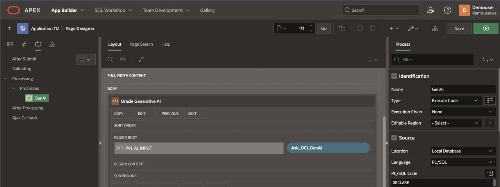

2. We would like to execute the code when the Button is Pressed, select the button by its name.

    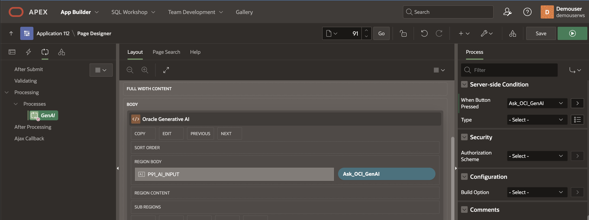

3. Copy paste this PL/SQL code block, you can also download it from my GitHub repo, replace your compartment id, credential name and page numbers in input and output APEX page items. 
   
    ```
    <copy> 
        -- PL/SQL code block to Generate AI Text from Oracle Generative AI service 
        -- Replace Compartment OCID, Web credentials and page number for APEX page items P91_AI_INPUT, P91_AI_OUTPUT
        ----------------------

        DECLARE
        
        l_genai_rest_url    VARCHAR2(4000) := 'https://inference.generativeai.us-chicago-1.oci.oraclecloud.com/20231130/actions/generateText'; 

        l_web_cred        CONSTANT VARCHAR2(50)   
        := '<Your_Web_Credentials>';   
        l_input varchar2(4000) := :P91_AI_INPUT;
        l_response_json CLOB;
        l_text varchar2(4000);
        
        -- Request payload JSON
            l_ocigabody varchar2(1000) := '{ 
                    "inferenceRequest": {
                            "runtimeType": "COHERE",
                            "prompt": "'||l_input||'",
                            "maxTokens": 500,
                            "numGenerations": 1,
                            "returnLikelihoods": "GENERATION",
                            "isStream": false
                    }, 
                    "servingMode": { 
                        "servingType": "ON_DEMAND",
                        "modelId": "cohere.command-light"
                    }, 
                    "compartmentId": "<Your-Compartment-OCID>"
            }';

        -- Cursor for Response Payload 
        CURSOR C1  IS 
                    SELECT jt.* 
                    FROM   JSON_TABLE(l_response_json, '$' 
                            COLUMNS (text VARCHAR2(4000)  PATH '$.inferenceResponse[0].generatedTexts[0].text' )) jt; 

        BEGIN

        if l_input is not null then

                apex_web_service.g_request_headers.DELETE; 
                apex_web_service.g_request_headers(1).name  := 'Content-Type'; 
                apex_web_service.g_request_headers(1).value := 'application/json';  

                l_response_json := apex_web_service.make_rest_request 
                (p_url                  => l_genai_rest_url, 
                    p_http_method          => 'POST', 
                    p_body                 => l_ocigabody, 
                    p_credential_static_id => l_web_cred); 

            For row_1 In C1 Loop
                l_text := row_1.text; 
                    -- Display AI Response
                    :P91_AI_OUTPUT := l_text; 
            End Loop;

            end if;

        END;
    </copy>
    ``` 
4. Few important request parameters
   
   * Tokens: A token is a word, part of a word, or a punctuation. For example, apple is a token and friendship is made up of two tokens, friend and ship.  
   * Temperature:How random to generate the output text. To generate the same output for a prompt every time you run that prompt, use 0. To generate a random new text for that prompt, increase the temperature. Default temperature is 1
   * Likelihood: In a large language model's output, how likely it would be for a token to follow the current generated token. When a large language model generates a new token for the output text, a likelihood is assigned to all tokens, where tokens with higher likelihoods are more likely to follow the current token. 

## Task 9: Run the page by pressing the Green button

1. Run the Oracle APEX Page by clicking on Green button as shown.

    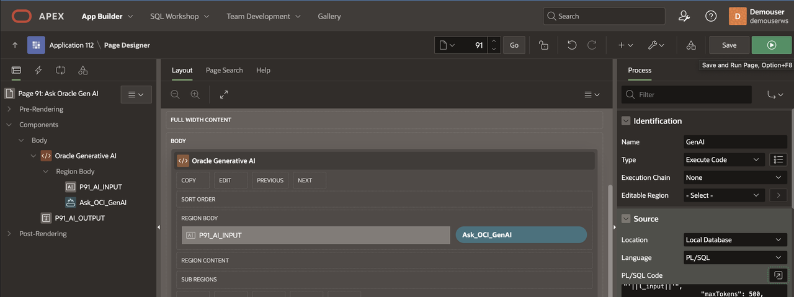

## Task 10: Generative AI responses to various input Prompts 

1. We can observe various response from Generative AI based on different input prompts 

    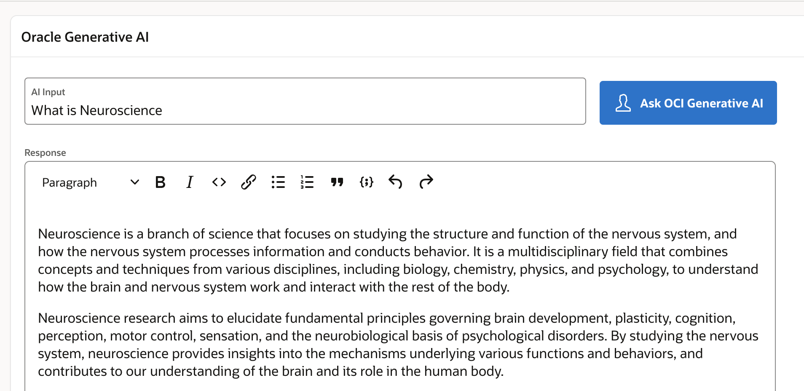

2. Writing Email

    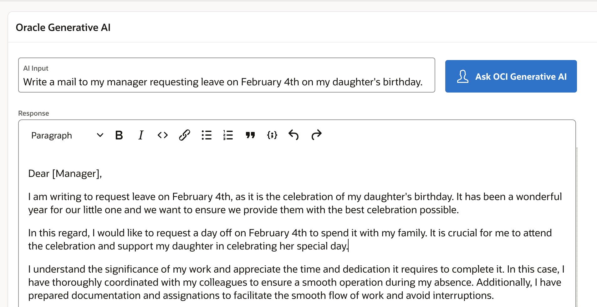

3. Writing Code

    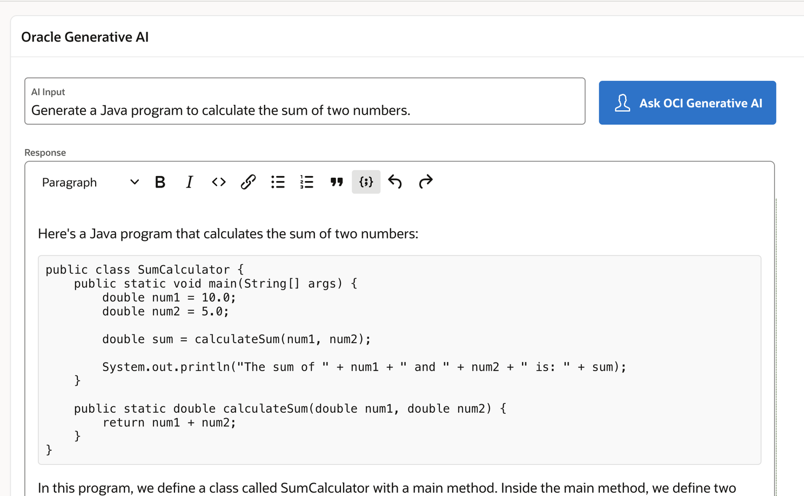

4. Writing Documentary

    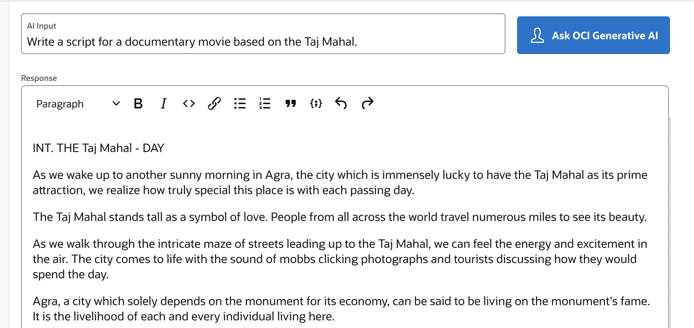

5. Generating SQL

    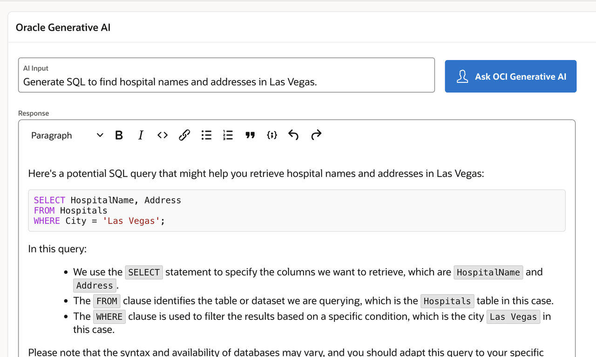

6. Generating responses to other languages for example Simplified Chinese input as shown below.  

    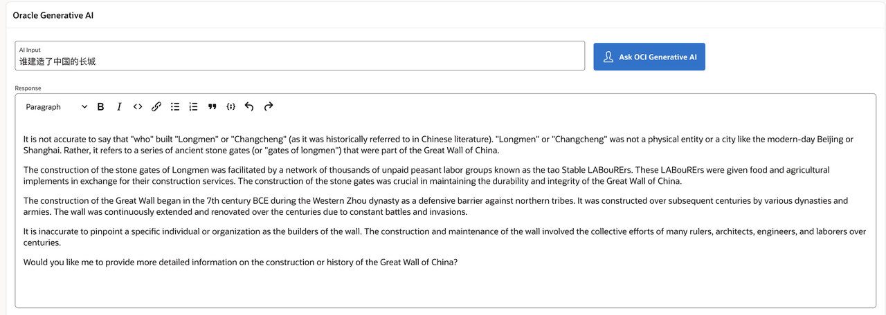
 
 
Congratulations on completing this lab!, You may now **proceed to the next lab**

## Learn More

* [Concepts for Generative AI](https://docs.oracle.com/en-us/iaas/Content/generative-ai/concepts.htm) 
* [How to build intelligent applications using Oracle Generative AI and Oracle APEX](https://www.linkedin.com/pulse/how-build-intelligent-apps-oracle-generative-ai-apex-madhusudhan-rao-z423f)

## Acknowledgements

* **Architect, Author and Developer** - [Madhusudhan Rao B M](https://www.linkedin.com/in/madhusudhanraobm/), Principal Product Manager, Oracle Database
* **Last Updated By/Date** - Jan 15th, 2024.