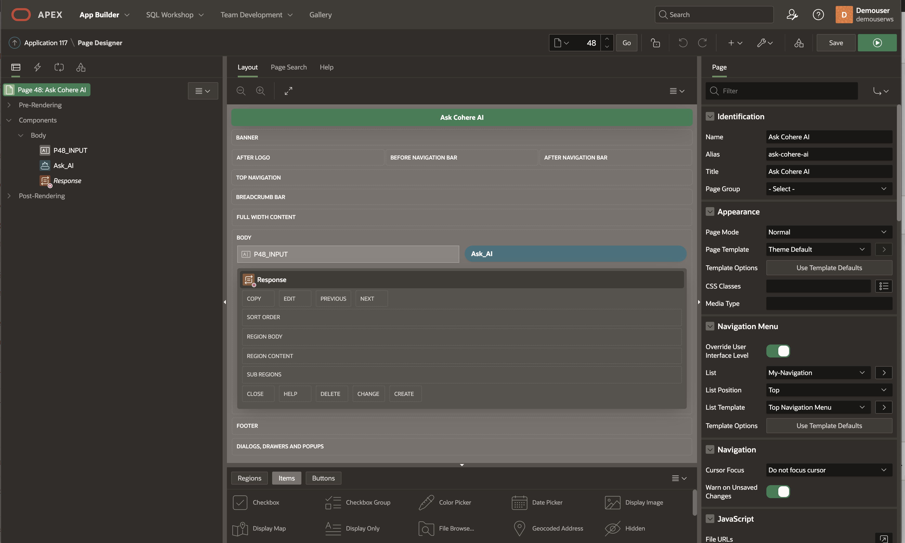
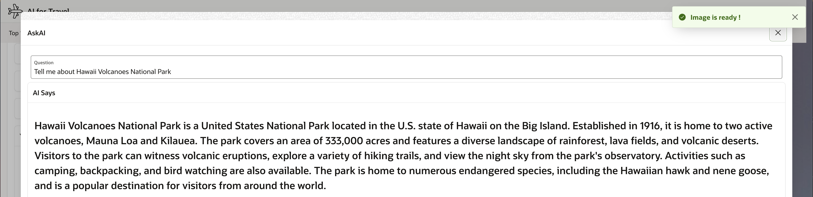

# Generative AI (Text)

## Introduction

In this lab, you will learn how to Generate AI Text using Cohere or OpenAI REST APIs and help Travelers answer their questions related to the UNESCO site or activities around that site or even about the City itself.

Estimated Lab Time: 45 minutes

### Objectives

In this lab, you will:

- Generate AI Text using Cohere REST APIs. 

### Prerequisites:

- Completed Previous Labs and have access to Oracle APEX application.
- Knowledge of Oracle APEX and PL/SQL.
- Cohere API Key access.

### About Cohere

Please read about [Cohere](https://cohere.com/) and their usage terms and conditions.


### Transform your products with LLMs

It’s never been easier to add AI to your products. Cohere’s models power interactive chat features, generate text for product descriptions, blog posts, and articles, and capture the meaning of text for search, content moderation, and intent recognition.

Using Cohere’s powerful embeddings models, you can make your applications understand the meaning of text data at massive scale, unlocking powerful semantic search, classification, and rerank capabilities.
 
### **Question 1:** *Things to Do at the Statue of Liberty, USA?*
  
### **Cohere Response**

  * Take a tour of the pedestal and crown. 
  * Visit the museum. Eat at one of the many nearby restaurants. 
  * Visit the gift shop. Take a walk around the island. 
  * See the statue from the water on a guided tour.
 
### **Question 2:** *What are the top 5 things to do in new york on vacation with family?*
 
### **Cohere Response**

  * Visit the Empire State Building 
  * See a Broadway show 
  * Stroll through Central Park 
  * Take a ride on the Staten Island Ferry 
  * Visit the Museum of Modern Art

## Task 1: Sign up at Cohere

1. Sign up and Sign in and [generate AI API Key](https://dashboard.cohere.ai/api-keys)  

2. Generate Cohere API Key and read API key [limitations](https://docs.cohere.com/docs/going-live)

     

## Task 2: Getting Response from Cohere

1. Review the request JSON, Call API end point at https://api.cohere.ai/v1/generate

    ```json
    <copy> 
        {  
            "model": "command",
            "prompt": "Your input text here",
            "max_tokens": 300,
            "temperature": 0.9,
            "k": 0,
            "stop_sequences": [],
            "return_likelihoods": "NONE"
    }   
    </copy>
    ```

2. Review the response JSON

    ```json
    <copy> 
        {
            "id": "2c5fd5d6-743c-4a52-****-*****",
            "generations": [
                {
                    "id": "46907fbb-1d86-40fc-ba70-806d658ee901",
                    "text": "\n your answer goes here  "
                }
            ],
            "prompt": "your question goes here",
            "meta": { "api_version": 
                        { 
                            "version": "1" 
                        } 
                    }
    }
    </copy>
    ```

3. PL/SQL Code to send request and get response back from Cohere, you can create an Oracle APEX Dynamic Region to display the results taking input from a page item after submitting the page. Construct PL/SQL Code block, Replace this code in the PL/SQL Dynamic content window, use [JSON_TABLE](https://docs.oracle.com/en/database/oracle/oracle-database/19/sqlrf/JSON_TABLE.html) to create a PL/SQL cursor 


     

1. Response Dynamic PL/SQL block code

    ```sql
    <copy> 
        DECLARE
    
        l_url    VARCHAR2(4000) := 'https://api.cohere.ai/v1/generate';  
        l_input VARCHAR2(4000) := :P48_INPUT;
        
            l_body   VARCHAR2(4000) := '{
                "model": "command",
                "prompt": "'||l_input||'",
                "max_tokens": 300,
                "temperature": 0.9,
                "k": 0,
                "stop_sequences": [],
                "return_likelihoods": "NONE"
                }';
            l_response_json CLOB;
            l_text VARCHAR2(4000);

        CURSOR C1  IS 
            SELECT jt.* 
            FROM   JSON_TABLE(l_response_json, '$' 
                    COLUMNS (text VARCHAR2(2000)  PATH '$.generations[0].text' )) jt; 

        BEGIN

        if l_input is not null then

        apex_web_service.g_request_headers(1).name := 'Content-Type';
            apex_web_service.g_request_headers(1).value := 'application/json';
            apex_web_service.g_request_headers(2).name := 'Authorization';
            apex_web_service.g_request_headers(2).value := 'Bearer Your-cohere-API-Key';

        l_response_json := apex_web_service.make_rest_request( 
            p_url => l_url, 
            p_http_method => 'POST', 
            p_body => l_body  
        );

        --Htp.p(l_response_json ); 

            For row_1 In C1 Loop
                l_text := row_1.text;
                    Htp.p(  l_text );  
            End Loop;

            end if;

        END;     
    </copy>
    ```
 
## Task 3: Demo

1. Login into **AI for Travel** Oracle APEX Application, Select UNESCO Site or Airport or Accommodation and Ask AI about it. 
 
2. Ask AI about an UNESCO site.
    
    

3. Ask AI about another UNESCO site.   

    

4. Ask AI about an Accommodation site and Generate AI Image

    

    
 
Congratulations on completing this lab!, You may now **proceed to the next lab**

## Learn More

* [JSON_TABLE](https://docs.oracle.com/en/database/oracle/oracle-database/19/sqlrf/JSON_TABLE.html) 
* [About Cohere](https://cohere.com/)

## Acknowledgements

* **Architect, Author and Developer** - [Madhusudhan Rao B M](https://www.linkedin.com/in/madhusudhanraobm/), Principal Product Manager, Oracle Database
* **Last Updated By/Date** - Dec 4th, 2023.

 