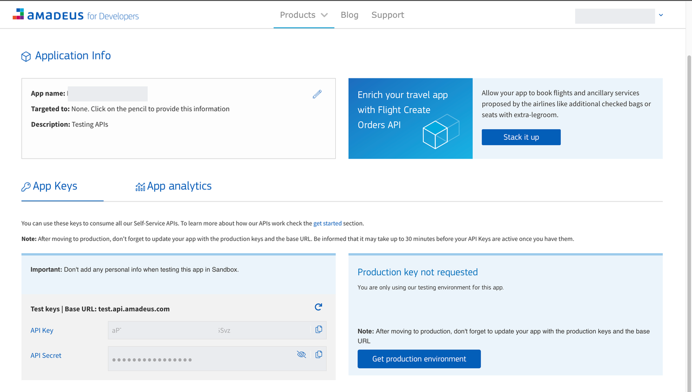
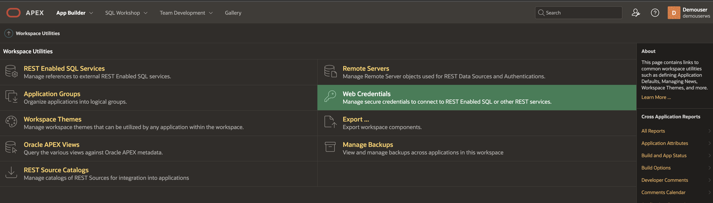
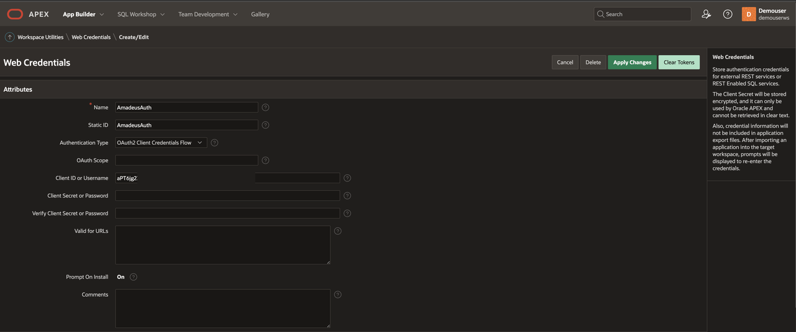
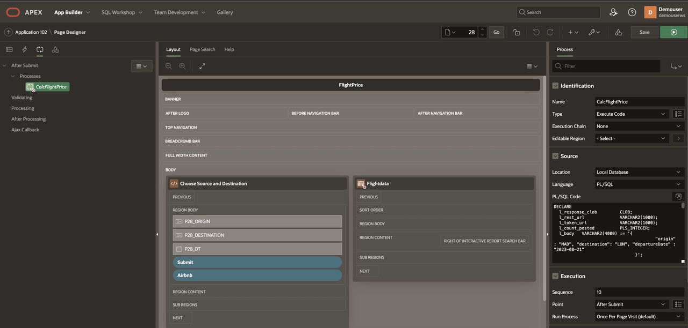
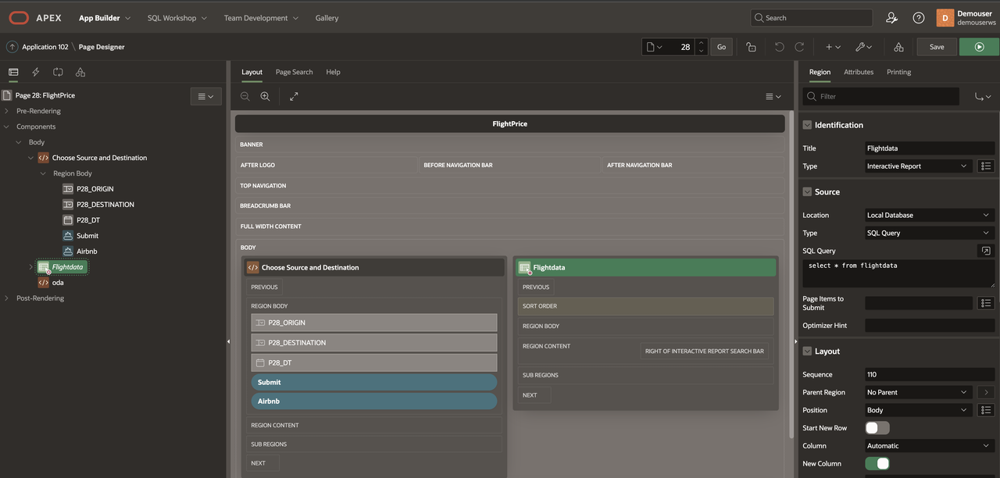
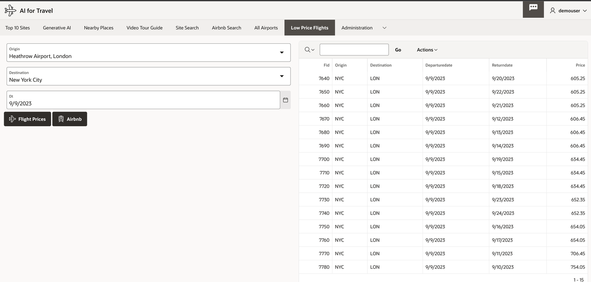

# Low Price Flight Tickets

## Introduction

In this Lab, we will integrate with Amadeus Travel APIs to find out low-price airfares and plan our return dates based on available fares. This can also be extended further to look for offers on each of these flights that this Lab does not cover. 

Estimated Lab Time: 45 minutes

### Objectives

In this lab, you will:

- To find lowest price flight from source location of traveler to destination UNESCO site Airport based on traveling date

### Prerequisites:

This lab assumes you have:

* You have Completed **Get Started**
* Autonomous Database has been created.
* You would need access to Amadeus API Keys, please read their terms and conditions from their website.  

### About Amadeus APIs

[Amadeus](https://amadeus.com/) provides access to APIs solutions that unlock travel content and services, as well as to all resources developers that may need to take full advantage of those APIs. 

[Amadeus Web Services](https://amadeus.com/en/topic/api) is a unique point of access for all Amadeus content and has been built on scalable Open System architecture and XML formatting to ensure that you always remain at the cutting-edge of architecture and technology.

### How to find the cheapest routes from a given airport 

The Amadeus Flight Inspiration Search API returns a list of the cheapest destinations from a given departure airport. To ensure the quickest response, the API provides results from a large cache of flight prices updated daily.  

To call the API, we just need to provide the IATA airport code of our city of departure. We can further customize our request using optional parameters like departure date range, maximum price or trip duration.  

## Task 1: Sign Up and Sign In to Amadeus
 
1. Sign up and Sign into [Amadeus Developer site](https://developers.amadeus.com/my-apps) and create your App.
2. Amadeus Developer Dashboard
   
3. Read their [Get started guide](https://developers.amadeus.com/get-started/get-started-with-self-service-apis-335)
4. Let’s look at an example request for the cheapest routes from London in December 2021: 

    GET https://test.api.amadeus.com/v1/shopping/flight-destinations?origin=LON&departureDate=2021-12-01,2021-12-31 
 
## Task 2: Create Web Credentials

1. Under APEX **Workspace Utilities**, select **Web Credentials**
   
2. Web Credentials
   
    
   
3. Under Authentication Type select **OAuth2 Client**, copy paste the Client ID and Client Secret
   
4. OAuth2 Client
   
    

## Task 3: Create APEX Page
 
1. Add a Process on submit of a button, which will invoke the REST API and get the flight prices
2. Record the flight price data into a temporary table, the data includes source airport code, destination airport code, travel date and prices based on dates choose.
   
    

3. PL/SQL code  

    ```sql
        <copy> 
            DECLARE
            l_response_clob         CLOB;
            l_rest_url              VARCHAR2(1000);
            l_token_url             VARCHAR2(1000);
            l_count_posted          PLS_INTEGER; 
            l_type VARCHAR2(100); 
            l_returnDate VARCHAR2(100);
            l_total NUMBER;
            l_locations VARCHAR2(100); 
            l_origin VARCHAR2(100) := :P28_ORIGIN; --- 'MAD' (Airport Code)
            l_destination VARCHAR2(100) := :P28_DESTINATION ; -- 'LON' (Airport Code) 
            -- Date of Journey, This can be replaced by a variable
            l_departureDate VARCHAR2(100) := '2023-09-09';  
            fid FLIGHTDATA.fid%TYPE; 

            CURSOR C1  IS 
            SELECT jt.* 
            FROM   JSON_TABLE(l_response_clob, '$.data[*]'  
            COLUMNS  
                (l_type VARCHAR2(100) PATH '$.type',
                l_departureDate VARCHAR2(100) PATH '$.departureDate',
                l_returnDate VARCHAR2(100) PATH '$.returnDate',
                l_total number PATH '$.price[0].total'  )
            ) jt; 

            BEGIN

            l_rest_url  := 'https://test.api.amadeus.com/v1/shopping/flight-dates?origin='||l_origin||'&destination='||l_destination||'&departureDate='||l_departureDate||'';
            l_token_url := 'https://test.api.amadeus.com/v1/security/oauth2/token';

            apex_web_service.g_request_headers.DELETE; 
            apex_web_service.g_request_headers(1).name  := 'Content-Type'; 
            apex_web_service.g_request_headers(1).value := 'application/json'; 

            l_response_clob := apex_web_service.make_rest_request 
            (p_url                  => l_rest_url, 
            p_http_method          => 'GET',  
            p_credential_static_id => 'AmadeusAuth',
            p_token_url            => l_token_url ); 

            -- Use a temporary table to store flight price data and retrieve it back in the page 
            DELETE FROM FLIGHTDATA;
            For row_1 In C1 Loop
                l_type := row_1.l_type;
                l_departureDate := row_1.l_departureDate;
                l_returnDate := row_1.l_returnDate;
                l_total := row_1.l_total;   
                INSERT INTO FLIGHTDATA (Origin, Destination, DepartureDate, ReturnDate, price ) 
                VALUES (l_origin, l_destination, 
                to_char(to_date(l_departureDate,'yy-MM-dd')),
                to_char(to_date(l_returnDate,'yy-MM-dd')), 
                l_total);   
            End Loop;     

            IF apex_web_service.g_status_code != 200 then 
                raise_application_error(-20112,'Unable to call OCI Flight Price Service.');  
            END IF;  

            END;     
        </copy>
        ```

4. Run a select query against flight data table to display flight prices
   
    

## Task 4: Demo

1. Input Origin Airport,Destination Airport code and Date of Journey 
   
    

    This concludes this lab and you can **proceed to the next lab**.

## Learn More

* [Cheap Flights](https://developers.amadeus.com/blog/cheap-flights-to-anywhere-amadeus-flight-search) 

## Acknowledgements

* **Author** - Madhusudhan Rao B M, Principal Product Manager, Oracle Database
* **Last Updated By/Date** - Dec 4th, 2023.