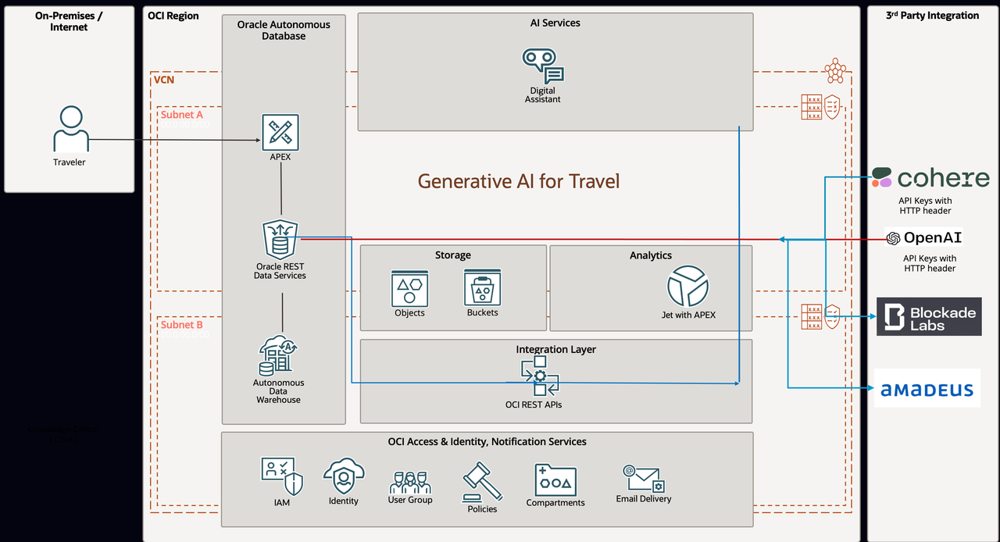

# Introduction

### About this workshop 

This workshop showcases a 360-degree view of UNESCO heritage sites to Travelers. Visualize how it feels to be there in that place now. They can also ask Travel expert guide questions related to that UNESCO heritage site, such as its History, activities around it or places for shopping. This also helps to find the nearest accommodations available or look out for other nearby UNESCO sites and Airports. 

Travelers can also plan for an Airbnb accommodation within their budget and nearby, preview it inside and get a street view. Ask for the activities around that place.
 
Once the Travel plan is made, find the low-fare plane tickets from their location to the UNESCO site and plan their return journey.
 
Leverage digital assistants' capability to find information related to Travel advisory, Passport related questions or Visa documentation. All this leveraging the power of Generative AI for Travel.

*Estimated Workshop Time: 5 hours (Approximately)*

### Prerequisites 
 
This lab assumes you have:

* An Oracle account
* Advanced Developer Knowledge of Oracle APEX and Oracle PL/SQL
* If you are new to Oracle APEX or PL/SQL, please refer related other Oracle Livelabs on those topics

## About Generative Artificial Intelligence (AI) 

Generative artificial intelligence (AI) is artificial intelligence capable of generating text, images, or other media in response to prompts. Generative AI models learn the patterns and structure of their input training data by applying neural network machine learning techniques, and then generate new data that has similar characteristics. 

[**Generative AI**](https://en.wikipedia.org/wiki/Generative_artificial_intelligence) has potential applications across a wide range of industries, including art, writing, software development, product design, healthcare, finance, gaming, marketing, and fashion.Investment in generative AI surged during the early 2020s, with large companies such as Microsoft, Google, and Baidu as well as numerous smaller firms developing generative AI models.

Source: [Wikipedia.org](https://www.gartner.com/en/topics/generative-ai)

Generative AI can learn from existing artifacts to generate new, realistic artifacts (at scale) that reflect the characteristics of the training data but don’t repeat it. It can produce a variety of novel content, such as images, video, music, speech, text, software code and product designs.

Generative AI uses a number of techniques that continue to evolve. Foremost are AI foundation models, which are trained on a broad set of unlabeled data that can be used for different tasks, with additional fine-tuning. Complex math and enormous computing power are required to create these trained models, but they are, in essence, prediction algorithms.
 

Today, generative AI most commonly creates content in response to natural language requests — it doesn’t require knowledge of or entering code — but the enterprise use cases are numerous and include innovations in drug and chip design and material science development.

In a recent Gartner webinar poll of more than 2,500 executives, 38% indicated that customer experience and retention is the primary purpose of their generative AI investments. This was followed by revenue growth (26%), cost optimization (17%) and business continuity (7%).

Source: [Gartner.com](https://www.gartner.com/en/topics/generative-ai)

  
### Generative AI for Travel - Technology Architecture

Technology Architecture of Generative AI for Travel Application

 
### Generative AI for Travel - Table of Contents

*Common Labs - Introduction Lab to Lab 2*

These are common labs that are required for most of the other labs under this workshop.

* Introduction
    * About the workshop
    * Table of Contents  
* Get Started
    * Sign-in to Oracle [cloud web console](cloud.oracl.com) 
* Lab 1: Provision of an [**Oracle Autonomous Database**](https://www.oracle.com/in/autonomous-database/)
    * Create or select a compartment
    * Choose Autonomous Database from the OCI services menu
    * Create the Autonomous Database instance

*Generative AI Labs*

* Lab 3: Generate AI Image
    * AI image generation platforms, decision making process, answering what, why and how.
    * Sign up and Sign in to your AI API service provider
    * Understand Request and Response from POSTMAN client
    * Create an APEX Page
    * Getting Pannellum Lightweight Panorama Viewer for the Web
    * PL/SQL code to bring Generative AI Image into your Application.
    * Generative AI Image Generation Demo
* Lab 4: Generate AI Text
    * Text AI Generative Platform - what, why and how we choose
    * Sign up at Cohere
    * Getting Response from Cohere
    * Sign up at OpenAI
    * Getting Response from OpenAI
    * Generative AI Text Generation Demo
* Lab 5: Top 10 UNESCO Sites
    * Panorama Viewer for the Web
    * Upload Pre-generated AI Images to Shared Application files.
    * Display Top 10 UNESCO Sites.
    * Demo

*Locate Nearby Airports and Other UNESCO Sites*

* Lab 6: Introduction
    * Locate Nearest Airport
    * Locate Nearest UNESCO Site
    * Plot the Map

*3rd Party Integrations*

* Lab 7: Low Price Flight Tickets
    * Sign Up and Sign In to Amadeus
    * Create Web Credentials
    * Create APEX Page to display flight prices, flight available dates and current price

*Oracle Digital Assistant Chatbot*

* Lab 8: Create Travel Advisor Chatbot
    * Provision Oracle Digital Assistant from OCI services
    * Create Oracle Digital Assistant Skill
    * Adding Knowledge document for Frequently asked questions (FAQs)
    * Train the ODA Model
    * Preview the Model and Skill
    * Add Auto Complete Suggestion and Utterances.
    * Create Web Channel for a Skill

* Lab 9: Introduction
    * Download ODA Oracle Native Client SDK
    * Get channel id from ODA console.
    * Configure settings.js file
    * Upload CSS, Image and JS files to Oracle APEX
    * HTML Code to add ODA chatbot on APEX page.
    * Bot Initiated Conversation (Optional step).
    * Update YAML flow in ODA (Optional step)
    * Demo of Chatbot in Oracle APEX Page
   
You may now **proceed to the next lab**.
    
## Acknowledgements

* **Architect, Author and Developer** - [Madhusudhan Rao B M](https://www.linkedin.com/in/madhusudhanraobm/), Principal Product Manager, Oracle Database
* **Advisor** - [Bo English-Wiczling](https://www.linkedin.com/in/boenglish/), Senior Director, Database Developer Relations
* **Last Updated By/Date** - July 28th, 2023
