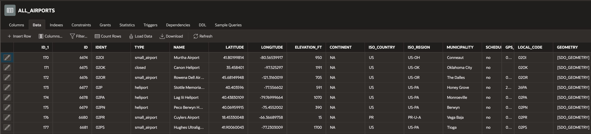

# Create Schema and Load Data

## Introduction

In this lab, we will create various tables and load data. These tables will be used in other labs in this workshop.

Estimated Time: 20 minutes

### Objectives

In this lab, you will:

- Create Tables and Load Data into an Oracle Autonomous Database

### Prerequisites

- This lab requires completion of the Get Started, and Oracle Autonomous Database should be already created.
- Oracle APEX workspace should be available, and you should have access to create tables.

## Task 1: Create ALL_AIRPORTS Table
 
1. The Table ALL\_AIRPORTS will contain data about Airport Names, Latitude, Longitude, Continent, Country and Region information, in addition there is a point based Geometry column SDO\_GEOMETRY. This Geometry column will help us find the nearest Airport from an UNESCO Site selected.

    ```sql
    <copy> 
        CREATE TABLE  ALL_AIRPORTS 
        (	
            ID NUMBER GENERATED BY DEFAULT ON NULL AS IDENTITY 
            MINVALUE 1 MAXVALUE 9999999999999999999999999999 
            INCREMENT BY 1 START WITH 1 CACHE 20 NOORDER  NOCYCLE  NOKEEP  NOSCALE  NOT NULL ENABLE,  
            IDENT VARCHAR2(50)  , 
            TYPE VARCHAR2(50)  , 
            NAME VARCHAR2(255)  , 
            LATITUDE NUMBER, 
            LONGITUDE NUMBER, 
            ELEVATION_FT NUMBER, 
            CONTINENT VARCHAR2(50) , 
            ISO_COUNTRY VARCHAR2(50) , 
            ISO_REGION VARCHAR2(50) , 
            MUNICIPALITY VARCHAR2(50) , 
            SCHEDULED_SERVICE VARCHAR2(50) , 
            GPS_CODE VARCHAR2(50) , 
            LOCAL_CODE VARCHAR2(50), 
            GEOMETRY "SDO_GEOMETRY", 
            PRIMARY KEY (ID)
            USING INDEX  ENABLE
        )   
        VARRAY "GEOMETRY"."SDO_ELEM_INFO" STORE AS SECUREFILE LOB 
        VARRAY "GEOMETRY"."SDO_ORDINATES" STORE AS SECUREFILE LOB ; 
    </copy>
    ```
2. To get data Google search *download all airports of the world dataset with latitude and longitude* or bring your own data.  
3. Sample Data

    

## Task 2: Create UNESCO_SITES Table
 
1. The Table UNESCO_SITES will hold site name, region, short description, Latitude, Longitude columns in addition there is a point based Geometry column SDO\_GEOMETRY. This Geometry column will help us find the nearest other UNESCO sites from a selected UNESCO Site.

    ```sql
    <copy> 
    CREATE TABLE UNESCO_SITES
    (    
        ID NUMBER GENERATED BY DEFAULT ON NULL AS IDENTITY MINVALUE 1 
        MAXVALUE 9999999999999999999999999999 INCREMENT BY 1 START WITH 1 CACHE 20 
        NOORDER  NOCYCLE  NOKEEP  NOSCALE  NOT NULL ENABLE, 
        CATEGORY VARCHAR2(50), 
        STATES_NAME_EN VARCHAR2(255), 
        REGION_EN VARCHAR2(255), 
        UNIQUE_NUMBER NUMBER, 
        ID_NO NUMBER, 
        REV_BIS VARCHAR2(50), 
        NAME_EN VARCHAR2(255), 
        SHORT_DESCRIPTION_EN VARCHAR2(4000), 
        JUSTIFICATION_EN VARCHAR2(4000), 
        DATE_INSCRIBED NUMBER, 
        SECONDARY_DATES VARCHAR2(50), 
        DANGER NUMBER, 
        DATE_END NUMBER, 
        DANGER_LIST VARCHAR2(50), 
        LONGITUDE NUMBER, 
        LATITUDE NUMBER, 
        AREA_HECTARES NUMBER, 
        CRITERIA_TXT VARCHAR2(255), 
        CATEGORY_SHORT VARCHAR2(1), 
        ISO_CODE VARCHAR2(50), 
        UDNP_CODE VARCHAR2(50), 
        TRANSBOUNDARY NUMBER, 
        GEOMETRY "SDO_GEOMETRY", 
        TOP_10 VARCHAR2(10), 
        PANORAMA VARCHAR2(400), 
        PRIMARY KEY (ID)
        USING INDEX  ENABLE
    )
    VARRAY "GEOMETRY"."SDO_ELEM_INFO" STORE AS SECUREFILE LOB 
    VARRAY "GEOMETRY"."SDO_ORDINATES" STORE AS SECUREFILE LOB ;
    </copy>
    ```

2. To get data Google search *download all unesco world heritage sites dataset with latitude and longitude* or bring your own data from any of the data sources that you have access.  

3. Sample Data

    

## Task 3: Create FLIGHT_DATA Table
 
1. You can name this table as FLIGHT\_PRICE\_DATA or just FLIGHTDATA this will used to write Origin, Destination, Return Date, Departure Date and Flight price temporarily as price and dates keep changing.

    ```sql
    <copy> 
        CREATE TABLE FLIGHTDATA 
        (    
            FID NUMBER GENERATED BY DEFAULT ON NULL AS IDENTITY 
            MINVALUE 1 MAXVALUE 9999999999999999999999999999 INCREMENT BY 
            10 START WITH 10 CACHE 20 NOORDER  NOCYCLE  NOKEEP  NOSCALE  NOT NULL ENABLE, 
            ORIGIN VARCHAR2(50) , 
            DESTINATION VARCHAR2(128)  , 
            DEPARTUREDATE DATE, 
            RETURNDATE DATE, 
            PRICE NUMBER, 
            PRIMARY KEY (FID)
            USING INDEX  ENABLE
        )    ;
    </copy>
    ```

2. This table does not need any pre-populated data. 
 
## Task 4: Create AIRBNB Table

1. This Table AIRBNB will hold Hostname, neighbourhood, short description, price, room type, Latitude, Longitude columns. Optionally you can generate SDO_GEOMETRY Column from the Latitude and Longitude columns

    ```sql
    <copy> 
        CREATE TABLE "AIRBNB" 
        (	
            "ID_1" NUMBER GENERATED BY DEFAULT ON NULL AS IDENTITY 
            MINVALUE 1 MAXVALUE 9999999999999999999999999999 INCREMENT BY 
            1 START WITH 1 CACHE 20 NOORDER  NOCYCLE  NOKEEP  NOSCALE  NOT NULL ENABLE, 
            "ID" NUMBER, 
            "NAME" VARCHAR2(255) COLLATE "USING_NLS_COMP", 
            "HOST_NAME" VARCHAR2(100) COLLATE "USING_NLS_COMP", 
            "NEIGHBOURHOOD_GROUP" VARCHAR2(50) COLLATE "USING_NLS_COMP", 
            "NEIGHBOURHOOD" VARCHAR2(50) COLLATE "USING_NLS_COMP", 
            "LATITUDE" NUMBER, 
            "LONGITUDE" NUMBER, 
            "COUNTRY" VARCHAR2(50) COLLATE "USING_NLS_COMP", 
            "CANCELLATION_POLICY" VARCHAR2(50) COLLATE "USING_NLS_COMP", 
            "ROOM_TYPE" VARCHAR2(50) COLLATE "USING_NLS_COMP", 
            "CONSTRUCTION_YEAR" NUMBER, 
            "PRICE" VARCHAR2(50) COLLATE "USING_NLS_COMP", 
            "SERVICE_FEE" VARCHAR2(50) COLLATE "USING_NLS_COMP", 
            "MINIMUM_NIGHTS" NUMBER, 
            "NUMBER_OF_REVIEWS" NUMBER, 
            "AVAILABILITY_365" NUMBER, 
            "HOUSE_RULES" VARCHAR2(32767) COLLATE "USING_NLS_COMP", 
            PRIMARY KEY ("ID_1")
            USING INDEX  ENABLE
        )  DEFAULT COLLATION "USING_NLS_COMP" ;
    </copy>
    ```

2. To get data Google search *download airbnb dataset with latitude and longitude information* or bring your own data from any of the data sources that you have access.  

3. Sample Data

    

You may now **proceed to the next lab**.

## Acknowledgements

* **Author** - Madhusudhan Rao B M, Principal Product Manager, Oracle Database
* **Last Updated By/Date** - Dec 4th, 2023.