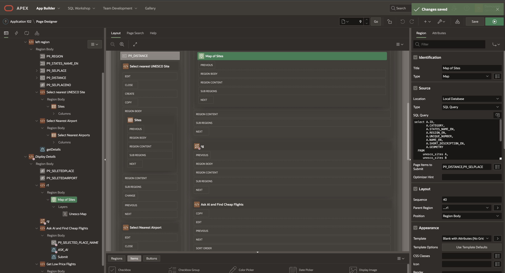

# Locate Nearby Airports and Other UNESCO Sites

## Introduction

TBD.

Estimated Time: 30 minutes.  

### About TBD

TBD.
 
### Objectives

In this lab, you will:
 
* TBD. 

### Prerequisites

This lab assumes you have:

* You have Completed **Get Started**  

## Task 1: Locate Nearest Airport
 
1. Nearest Airport to selected UNESCO Location with in the search radius.
 
    

2. SQL Query with Radio button group to Locate Nearest Airport

    
 
    ```sql
    <copy> 
    SELECT APEX_ITEM.RADIOGROUP 
        (
            1,
            p_value => B.ID,
            p_display => B.NAME 
        ) Airports
    FROM   
            UNESCO_SITES A,
            ALL_AIRPORTS B
    WHERE 
            rownum <= 20 AND A.UNIQUE_NUMBER = :P9_SELPLACE AND type != 'heliport'
        AND SDO_WITHIN_DISTANCE(
        GET_GEOMETRY(A.LONGITUDE, A.LATITUDE),
        B.GEOMETRY,
        'distance='||:P9_DISTANCE||' unit=mile') = 'TRUE'
    </copy>
    ```

## Task 2: Locate Nearest UNESCO Site

1. Nearest UNESCO Site to selected UNESCO Location with in the search radius.

    

2. SQL Query with Radio button group to Locate UNESCO Site
 
    ```sql
    <copy> 
    SELECT APEX_ITEM.RADIOGROUP 
        (
            2,
            p_value => A.UNIQUE_NUMBER,
            p_display => A.NAME_EN 
        ) sites
    FROM
            unesco_sites A,
            unesco_sites B
    WHERE
            B.UNIQUE_NUMBER = :P9_SELPLACE AND rownum <= 20
            AND SDO_WITHIN_DISTANCE(
            GET_GEOMETRY(A.LONGITUDE, A.LATITUDE),
            B.GEOMETRY,
            'distance='||:P9_DISTANCE||' unit=mile') = 'TRUE'
    </copy>
    ```

## Task 3: Plot the Map

1. Plot the Map based on nearest UNESCO location.

    

2. SQL Query to Plot Map based on nearest UNESCO Site from the selected site.

    

    ```sql
    <copy> 
    SELECT A.ID,
        A.CATEGORY,
        A.STATES_NAME_EN,
        A.REGION_EN,
        A.UNIQUE_NUMBER, 
        A.NAME_EN, 
        A.SHORT_DESCRIPTION_EN,
        A.GEOMETRY   
    FROM
        unesco_sites A,
        unesco_sites B
    WHERE
        B.UNIQUE_NUMBER = :P9_SELPLACE AND rownum <= 20
    AND SDO_WITHIN_DISTANCE(
        GET_GEOMETRY(A.LONGITUDE, A.LATITUDE),
        B.GEOMETRY,
        'distance='||:P9_DISTANCE||' unit=mile') = 'TRUE'
    </copy>
    ```
  
    This concludes this lab and you can **proceed to the next lab**.

## Learn More

* [Wiki Source](https://en.wikipedia.org/wiki/Electrocardiography)
* [ECG findings and CHD](https://www.sevencountriesstudy.com/ecg-predictors-and-coronary-heart-disease/)

## Acknowledgements

* **Author** - Madhusudhan Rao B M, Principal Product Manager, Oracle Database
* **Last Updated By/Date** - June 24th, 2023.