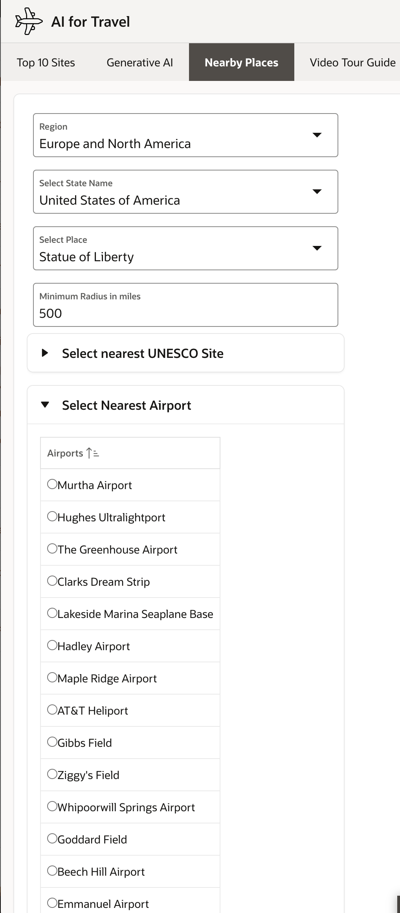
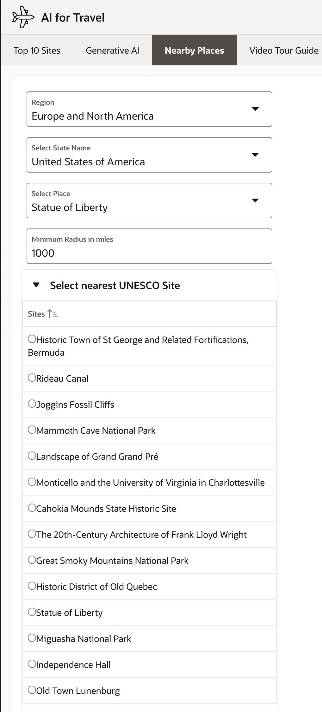

# Locate Nearby Airports and Other UNESCO Sites

## Introduction

TBD.

Estimated Time: 30 minutes.  

### About OCI Anomaly Detection

TBD.
 
### Objectives

In this lab, you will:
 
* TBD. 

### Prerequisites

This lab assumes you have:

* You have Completed **Get Started**  

## Task 1: Approach to ECG Interpretation - ECG Data Preparation
 
1. TBD.

    

    

    

    
 
 
    This concludes this lab and you can **proceed to the next lab**.

## Learn More

* [Wiki Source](https://en.wikipedia.org/wiki/Electrocardiography)
* [ECG findings and CHD](https://www.sevencountriesstudy.com/ecg-predictors-and-coronary-heart-disease/)

## Acknowledgements

* **Author** - Madhusudhan Rao B M, Principal Product Manager, Oracle Database
* **Last Updated By/Date** - June 24th, 2023.