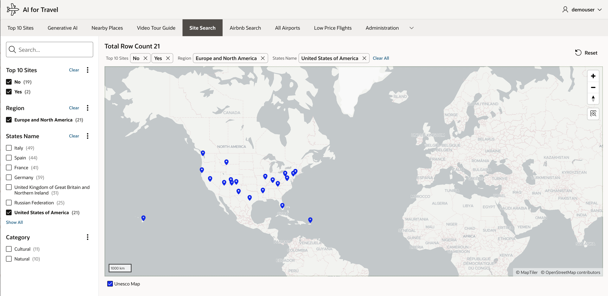

# Locate Nearby Airports and Other UNESCO Sites

## Introduction

TBD.

Estimated Time: 30 minutes.  

### About TBD

TBD.
 
### Objectives

In this lab, you will:
 
* TBD. 

### Prerequisites

This lab assumes you have:

* You have Completed **Get Started**  

## Task 1: Locate Nearest Airport
 
1. Nearest Airport to selected UNESCO Location with in the search radius.
 
    

## Task 2: Locate Nearest UNESCO Site

1. Nearest UNESCO Site to selected UNESCO Location with in the search radius.

    

## Task 3: Plot the Map

1. Plot the Map based on nearest UNESCO location.

    
  
    This concludes this lab and you can **proceed to the next lab**.

## Learn More

* [Wiki Source](https://en.wikipedia.org/wiki/Electrocardiography)
* [ECG findings and CHD](https://www.sevencountriesstudy.com/ecg-predictors-and-coronary-heart-disease/)

## Acknowledgements

* **Author** - Madhusudhan Rao B M, Principal Product Manager, Oracle Database
* **Last Updated By/Date** - June 24th, 2023.