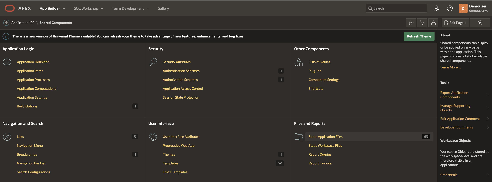
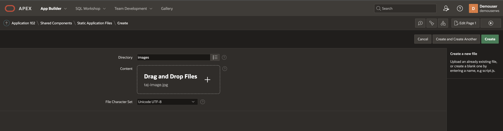

# Top 10 UNESCO Sites

## Introduction

Ten must-visit UNESCO World Heritage Sites. There are 1157 UNESCO World Heritage Sites (January 2023) across 167 countries. Among these, 900 are cultural, 218 are natural, and 39 are mixed properties. Here, we look at the Top 10 of UNESCO's must-visit world heritage sites one would love to visit.

In this lab, you will learn how to generate AI images of these sites and help travelers decide where they would like to visit this time.

Estimated Time: 30 minutes.  
  
### Objectives

In this lab, you will:
 
* Generate AI images of Top 10 UNESCO sites. 
 
### Prerequisites

This lab assumes you have:

* You have Completed Previous Labs
* You have basic knowledge of Oracle APEX, PL/SQL, HTML and CSS
 
## Task 1: Panorama Viewer for the Web 

1. Get [Panorama Viewer for the Web](https://pannellum.org/) on your Oracle APEX Web page is simple, just create a static region with following code. 
2. Add the following html code in static APEX region
3. APEX page static regions
   
4. Html code 
    ```html
        <copy> 
            <link rel="stylesheet" href="https://cdn.jsdelivr.net/npm/pannellum@2.5.6/build/pannellum.css"/>
        <script type="text/javascript" src="https://cdn.jsdelivr.net/npm/pannellum@2.5.6/build/pannellum.js"> 
        </script>
        </copy>
        ```
5. Add the following CSS code in static APEX region to adjust styling
6. CSS Code
    ```css
        <copy> 
            #panorama {
                width: 100vw;
                height: 100vh;
                padding: 0;
                margin: 0;
            }
            * {
                padding: 0;
                margin: 0;
            }   
            .pnlm-panorama-info  {
                position: absolute;
                bottom: 50px !important;  
                height: 50px !important;
                width: 400px !important;
                background-color: rgba(0,0,0,0.7);
                border-radius: 0 3px 3px 0;
                padding-right: 10px;
                color: #fff;
                text-align: left;
                display: none;
                z-index: 2;
                -webkit-transform: translateZ(9999px);
                transform: translateZ(9999px);
            }
            .pnlm-hotspot {
                height: 76px !important;
                width: 26px !important; 
            } 
        </copy>
        ```
 
## Task 2: Upload Pre-generated AI Images to Shared Application files.

1. In this lab we will use pre-generated [Skybox AI Images](https://skybox.blockadelabs.com/) and upload that to Oracle APEX shared static files

2. Under Application Shared Components > Files and Reports > Static Application Files
   
    

1. Upload Image to a Shared folder 

    

2. Copy the reference URL of the Image
   
    

## Task 3: Display Top 10 UNESCO Sites.

1. Create Oracle APEX page region to display Top 10 UNESCO Sites. 

    >**Note:** These are static-pre-generated AI images. We will show in other labs how to generate these AI images dynamically. The reason to use static images in this lab is to save time in generating these images programmatically.

    ```html
        <copy> 
            <div id="panorama"></div>
            <script>
            pannellum.viewer('panorama', {   
                "default": {
                    "firstScene": "circle",
                    "author": "Unesco Heritage",
                    "sceneFadeDuration": 1000,
                    "autoLoad": true
                }, 
                "scenes": {
                    "circle": {
                        "title": "Yellowstone National Park, USA",
                        "hfov": 110,
                        "pitch": -3,
                        "yaw": 117,
                        "type": "equirectangular",
                        "panorama": "#APP_FILES#images/realistic_yellowstone_national_park_usa.jpeg",
                        "hotSpots": [
                            {
                                "pitch": -2.1,
                                "yaw": 132.9,
                                "type": "scene",
                                "text": "Statue of Liberty, USA",
                                "sceneId": "id100"
                            }
                        ]
                    }, 
                    "id100": {
                        "title": "Statue of Liberty, USA",
                        "hfov": 110,
                        "yaw": 5,
                        "type": "equirectangular",
                        "panorama": "#APP_FILES#images/realistic_statue_of_liberty.jpeg",
                        "hotSpots": [
                            {
                                "pitch": -0.6,
                                "yaw": 37.1,
                                "type": "scene",
                                "text": "Mason Circle",
                                "sceneId": "circle",
                                "targetYaw": -23,
                                "targetPitch": 2,
                                "text": "Machu picchu,Peru",
                                "sceneId": "id101"
                            }
                        ]
                    },
                    "id101": {
                        "title": "Machu picchu,Peru",
                        "hfov": 110,
                        "yaw": 5,
                        "type": "equirectangular",
                        "panorama": "#APP_FILES#images/realistic_machu_picchu_peru.jpeg",
                        "hotSpots": [
                            {
                                "pitch": -0.6,
                                "yaw": 37.1,
                                "type": "scene",
                                "text": "Mason Circle",
                                "sceneId": "circle",
                                "targetYaw": -23,
                                "targetPitch": 2,
                                "text": "Cape Floral Region Protected Areas",
                                "sceneId": "id103"
                            }
                        ]
                    }, 
                    "id103": {
                        "title": "Cape Floral Region Protected Areas",
                        "hfov": 110,
                        "yaw": 5,
                        "type": "equirectangular",
                        "panorama": "#APP_FILES#images/realistic_cape_floral_region_south_africa.jpeg",
                        "hotSpots": [
                            {
                                "pitch": -0.6,
                                "yaw": 37.1,
                                "type": "scene",
                                "text": "Mason Circle",
                                "sceneId": "circle",
                                "targetYaw": -23,
                                "targetPitch": 2,
                                "text": "Nubian Monuments from Abu Simbel to Philae",
                                "sceneId": "id104"
                            }
                        ]
                    },
                    "id104": {
                        "title": "Nubian Monuments from Abu Simbel to Philae",
                        "hfov": 110,
                        "yaw": 5,
                        "type": "equirectangular",
                        "panorama": "#APP_FILES#images/realistic_nubian_monuments_egypt.jpeg",
                        "hotSpots": [
                            {
                                "pitch": -0.6,
                                "yaw": 37.1,
                                "type": "scene",
                                "text": "Mason Circle",
                                "sceneId": "circle",
                                "targetYaw": -23,
                                "targetPitch": 2,
                                "text": "Petra",
                                "sceneId": "id105"
                            }
                        ]
                    }    
                }
            });
            </script>
        </copy>
        ```

## Task 4: Demo

1. Run the APEX page

    
 
    This concludes this lab and you can **proceed to the next lab**.

## Learn More

* [Top 10 must see sites](https://timesofindia.indiatimes.com/travel/destinations/most-accessible-international-holiday-destinations/photostory/101794772.cms)

## Acknowledgements

* **Author** - Madhusudhan Rao B M, Principal Product Manager, Oracle Database
* **Last Updated By/Date** - June 24th, 2023.