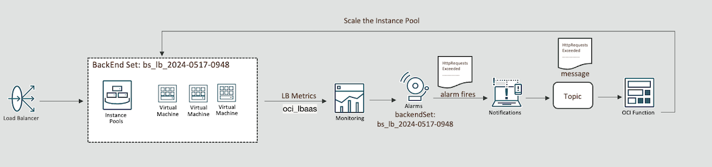

# Introduction

## About this Workshop

In this tutorial, you will deploy the infrastructure needed to automatically scale an instance pool based on the number of http requests received by the load balancer. The majority of the deployment has been automated with terraform. Once the scaling infrastructure has been deployed you will trigger a load and observe the scaling infrastructure.

Scaling by the http request metric is usefully when applications need to respond to rapid bursts of traffic and scale quickly. Http requests are a leading indicator of application load, while CPU and memory can be a trailing indicator for some applications.

Estimated Workshop Time: 110 Minutes

### High Level Architecture

### Objectives

In this workshop, you will learn how to:

* Create a Container Registry and push an image.
* Use Resource Manager to deploy a Terraform Stack.
* Deploy and use Apache JMeter to generate load.
* Use serverless and monitoring services.

### Prerequisites

This workshop assumes you have:

* An Oracle account.
* The ability to manage all resources in at least one compartment.
* Familiarity with Oracle Cloud Infrastructure (OCI) components like Compute, Networking, and Observability.
* Some understanding of Docker commands.
* Familiarity with Container Registry and Functions is helpful, but not required.
* Basic familiarity with open-source load testing tools like Apache JMeter.

## Task 1: Learn More

* [Functions](https://docs.oracle.com/en-us/iaas/Content/Functions/home.htm)
* [Container Registry](https://docs.oracle.com/en-us/iaas/Content/Registry/home.htm)
* [Monitoring](https://docs.oracle.com/en-us/iaas/Content/Monitoring/home.htm)
* [Notifications](https://docs.oracle.com/en-us/iaas/Content/Notification/home.htm)
* [Terraform on OCI](https://registry.terraform.io/providers/oracle/oci/latest/docs)

## Acknowledgements
* **Authors** - Ryan Palmaro and Animesh Sahay, Enterprise Cloud Architect
* **Contributor** -  Jason Yan, Enterprise Cloud Architect
* **Contributor** -  Joao Tarla, Oracle LAD A-Team Solution Engineer
* **Last Updated By/Date** - Ryan Palmaro, May 2025
