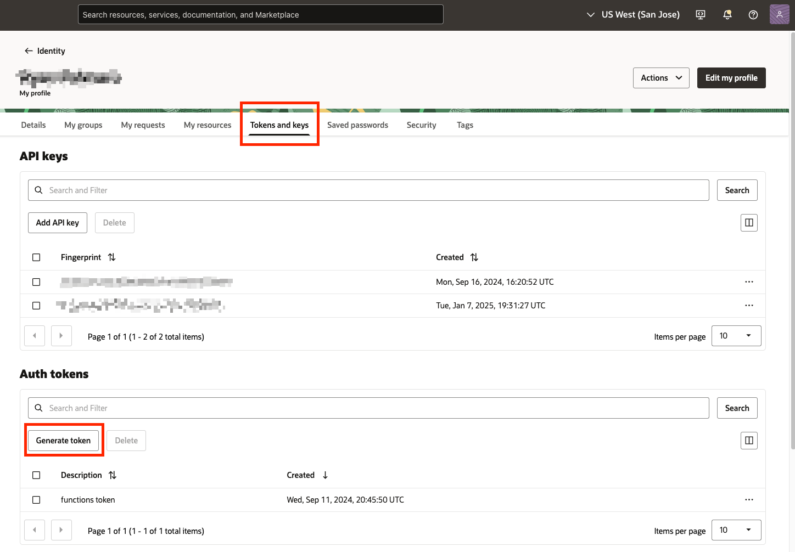
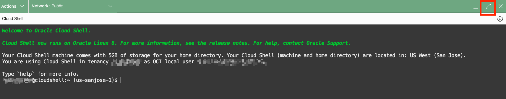

# Create a Container Registry and Push an Image

## Introduction

Oracle Cloud Infrastructure Registry (also known as Container Registry) is an Oracle-managed registry that makes it easy to store, share, and manage container images (such as Docker images). This workshop includes a function that is stored as a Docker image in a Container Registry that you will set up. When the function is invoked, it will pull the image from your Container Registry.

Estimated Time: 20 minutes

### Objectives

In this lab, you will learn how to:

* Create a Container Registry
* Create an Auth token
* Pull, Tag, and Push an Image.

### Prerequisites

This lab assumes you have:

* Some understanding of Docker commands.
* Basic familiarity with container registry concepts.

## Task 1: Sign in to OCI Console and create a Container Registry

1. Navigate to the Container Registry. From the **OCI Services menu**, click **Developer Services** > **Container Registry**.

    

    

2. Select the **Compartment** assigned to you from the drop down on the left part of the screen and click **Create repository**.

    

3. Type **function-repo** as the Repository name and leave the access as **Private**. Click **Create**.

    **Note:** Provided Docker commands shown later in the lab are expecting the container registry to be named as shown below.

    

4. Your function-repo has been created with zero images. Note the unique **Namespace** and save that for later use.

    

## Task 2: Create an Authentication Token

1. Click the **profile icon** in the upper right hand corner and select your **username**. This action will take you to your profile.

    

2. Navigate to **Token and keys** and then click **Generate token**.

    

3. Enter a useful description for your token and click **Generate token**.

    

4. **Click** the ellipsis menu and select **Copy**. Save your token in a safe place for later use. Once the token is stored, you may close this dialog box.

    ***Warning:** The token string will not be shown again. If you lose your auth token it will be gone forever and then you must create recreate it again.<br/>*

    

## Task 3: Get your Function Image

1. Click **Developer Tools** located in the top right of the console and select **Cloud Shell**. You can optionally maximize cloud shell for easier viewing of the command line.

    

    **Note:** If you have not used your cloud shell in a while, it may take a moment to initialize.

    

2. Log in to the Container Registry with the following command.

    ```bash
    <copy>
    docker login -u '<tenancy-namespace>/<user-name>' <region-key>.ocir.io
    </copy>
    ```

    **For example:** docker login -u 'ansh81vru1zp/jdoe@acme.com' phx.ocir.io

    

    **Note:**
    - In **Task 1, Step 4** you were asked to note the unique **Namespace** and save that for later use.
    - In **Task 2, Step 4** you were asked to save your token in a safe place for later use. When prompted for a password, enter your token.
    - The username is what you used to log in to OCI.
    - [Region key lookup.](https://docs.oracle.com/en-us/iaas/Content/Functions/home.htm) Find the region key for your current region as seen in the documentation example below.

    

    **Optional:** [More information on logging in to the Container Registry using Cloud Shell.](https://docs.oracle.com/en-us/iaas/Content/Functions/Tasks/functionsquickstartcloudshell.htm#functionsquickstartcloudshell_topic_setup_CloudShell_dev_env_Log_in_to_registry)

3. Pull the provided function image using the following command.

    ```bash
    <copy>
    docker pull sjc.ocir.io/ax0jeka3ncvz/lab/fn-autoscale-instance-pool:latest
    </copy>
    ```

    

4. Tag the image with the following command. Replace the **region-key** and **namespace** with the values you used in **Task 3, Step 2**.

    ```bash
    <copy>
    docker tag sjc.ocir.io/ax0jeka3ncvz/lab/fn-autoscale-instance-pool:latest [region-key].ocir.io/[namespace]/function-repo/fn-autoscale-instance-pool:latest
    </copy>
    ```

     

5. Push the image to your Container Registry with the following command. Replace the **region-key** and **namespace** with the values you used in **Task 3, Step 2**.

    ```bash
    <copy>
    docker push [region-key].ocir.io/[namespace]/function-repo/fn-autoscale-instance-pool:latest
    </copy>
    ```

    **Note:** the image path used for Docker push. You will use this image path again in the next lab.

     

6. Verify the image **fn-autoscale-instance-pool** has been pushed to your Container Registry **function-repo** with the following command.

    ```bash
    <copy>
    docker images
    </copy>
    ```

     

*Congratulations! You have successfully completed the lab.*<br/>
You may now **proceed to the next lab**.

## Acknowledgements
* **Authors** - Ryan Palmaro and Animesh Sahay, Enterprise Cloud Architect
* **Contributor** -  Jason Yan, Enterprise Cloud Architect
* **Contributor** -  Joao Tarla, Oracle LAD A-Team Solution Engineer
* **Last Updated By/Date** - Ryan Palmaro, May 2025
