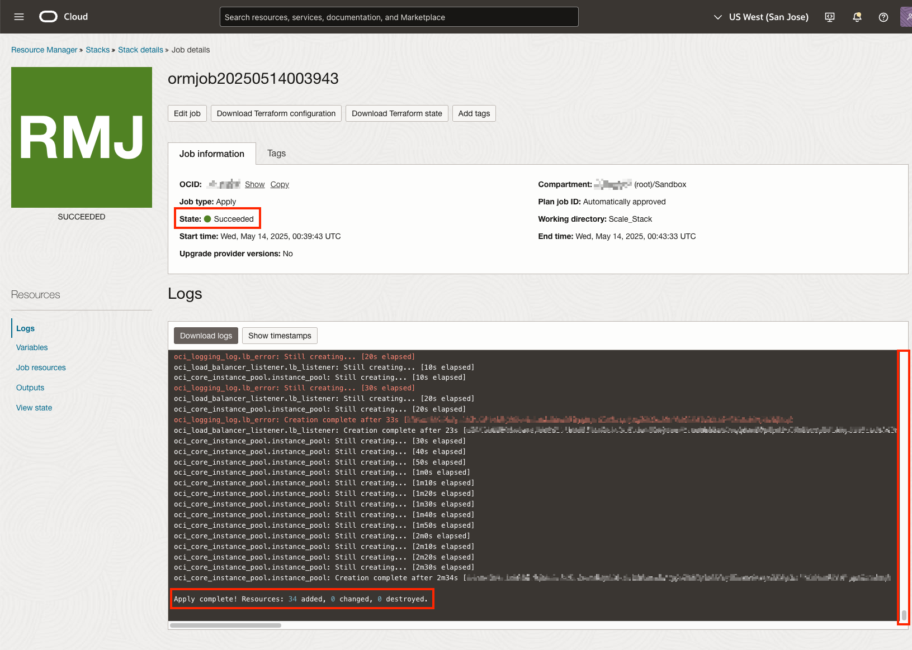

# Use Resource Manager to deploy a Terraform Stack

## Introduction

In this lab you will use Resource Manager to deploy a Terraform Stack. Resource Manager is a managed service that allows you to share and manage infrastructure configurations and state files across multiple teams and platforms. The provided stack will create the following resources:

- Virtual Cloud Network
- Load Balancer
- Instance Pool
- Instance Configuration
- Alarms
- Dynamic Group
- Policies
- Notifications
- Logging

Estimated Time: 10 minutes

### Objectives

In this lab, you will learn how to:

* Provision OCI resources using Resource Manager

### Prerequisites

This lab assumes you have:

* Understanding of high level Terraform concepts

## Task 1: Deploy the Scaling Stack in Resource Manager

1. Download the compressed Terraform Stack provided below. You will upload this compressed file to Resource Manager in a later step.

    [Click to Download](https://ax0jeka3ncvz.objectstorage.us-sanjose-1.oci.customer-oci.com/p/VFIx3caM35vnj-Nm43ymj5uiQ_c-V1E2FJVm0okpqmhhF-cjtjc7LB-zfRH5q8CX/n/ax0jeka3ncvz/b/ScaleStack/o/Scale_Stack.zip)

2. Navigate to OCI Resource Manager. From the **OCI Services menu**, click **Developer Services** > **Resource Manager** > **Stacks**.

    

    

3. Click **Create stack**.

    

4. Under Terraform configuration source, select **.Zip file**, then **drag** and **drop** the compressed file you downloaded in **Task 1, Step 1**, into the upload box.

    

5. Simplify the Stack Name (Optional) and then click **Next**.

    

6. Configure the variables in the General Configuration section and then click **Next**.

    

    **Note:**
    - **Region** is the current region you are in. The correct value will automatically populate.
    - **Identity Domain** will most likely be your Default Domain and is the only option unless additional Identity Domains have been configured.
    - **Policy Compartment** can be any compartment of your choosing; however, the root compartment is a common place for administrators to group policies.
    - **Infrastructure Compartment** will be the logical grouping of the infrastructure resources created by the Terraform Stack. You can choose any compartment available to you. For consistency, it is recommended to use the same compartment you chose for your Container Registry.
    - **Container Image Path** is the same uniform resource identifier you used in **Lab 1, Task 3, Step 5**. Do not include Docker Push into the image path or leave the placeholder for [region-key] and [namespace].

7. Select **Run apply** and then click **Create**. With Run apply selected, the stack will immediately provisions resources upon creation.

    

8. Observe that Resource Manager has **Accepted** the job and that the job type is **Apply**.

    

9. Observe that the job state is now **In progress** and as the job runs, more logs will become available.

    

10. Observe that the job has **Succeeded**, and if you scroll down to the bottom of the logs, you can see that 34 resources have been created.

    

*Congratulations! You have successfully completed the lab.* 
You may now **proceed to the next lab**.

## Acknowledgements
* **Authors** - Ryan Palmaro and Animesh Sahay, Enterprise Cloud Architect
* **Contributor** -  Jason Yan, Enterprise Cloud Architect
* **Contributor** -  Joao Tarla, Oracle LAD A-Team Solution Engineer
* **Last Updated By/Date** - Ryan Palmaro, May 2025
