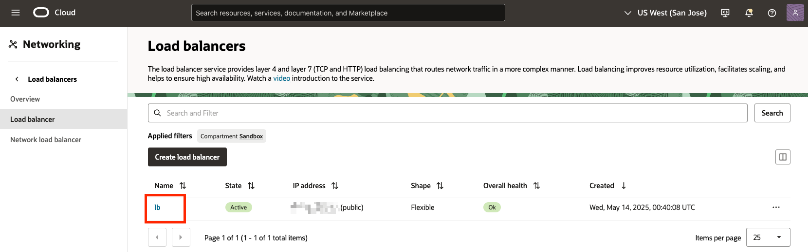
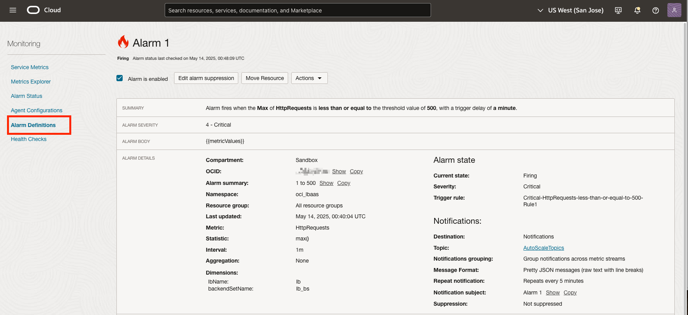
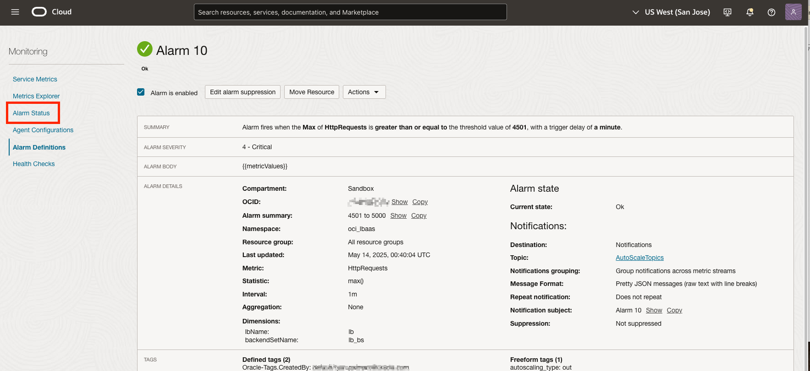
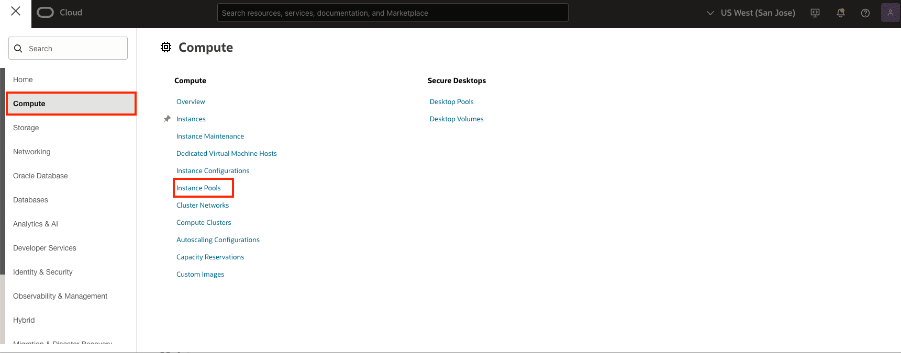
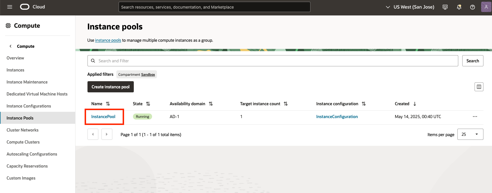

# Observe Newly Created Infrastructure without HTTP Traffic

## Introduction

In Lab 2, you provisioned infrastructure that can automatically scale an instance pool based on the quantity of http requests received by a load balancer. In this lab, you'll open multiple tabs to observe the scaling infrastructure at rest, before generating http load in a subsequent lab.

Estimated Time: 20 minutes

### Objectives

In this lab, you will better understand the following OCI resources:

* Load Balancer
* Instance Pool
* Alarms

### Prerequisites

This lab assumes you have:

* An understanding of core OCI Resources.
* Knowledge of where various resources are located in the OCI Console.

## Task 1: Observe the Load Balancer

1. Right click the **Oracle Cloud** logo in the top left corner. Select **Open Link in New Tab**. You will view the newly created load balancer resource named **lb** in this tab.

    

    Note: If you are using a browser other than chrome, the steps might be slightly different.

2. Use the **first new tab** to navigate to the **Load Balancer** service. From the **OCI Services Menu** > **Networking** > **Load Balancer**.

    

    

3. Having navigated to the load balancer service, click the load balancer resource name **lb**.

    

4. On the lb details page, click the **Monitoring** tab and observe near zero inbound request.

    

    

    **Note:** There will be a few single inbound requests from heath checks as the service is provisioning.

    **Attention:** You will return to this tab in a later lab.

## Task 2: Observe the Alarm Definitions and Alarm Status

1. Right click the **Oracle Cloud** logo in the top left corner. Select **Open Link in New Tab**. You will view the ten newly created Alarm resources in this tab.

    

    Note: If you are using a browser other than chrome, the steps might be slightly different.

2. Use the **second new tab** to navigate to the **Alarm** service. From the **OCI Services Menu** > **Observability & Management** > **Alarm Definitions**.

    

    

    **Note:** You may need to scroll dow to see the Alarm Definition in the Navigation Menu, depending on your screen resolution.

3. Having navigated to the Alarm service, note that there is a total of ten alarms.

    

4. Click the Alarm resource named **Alarm 1**.

    

5. Note the **Alarm Summary**, **Trigger rule**, **Dimensions**, **Alarm Body**, and **Notifications**.

    

    **About this alarm:**
    1. **Summary:** The alarm fires when the max number of HTTP requests is less than or equal to the threshold value of 500. There is a trigger delay of a minute, meaning the trigger rule must hold true for a minimum of one minute before the alarm will fire.
    2. **Trigger Rule:** The rule to trigger this alarm to fire is defined by the trigger rule. The trigger rule can be expressed as the following Monitoring Query Language expression. 

        ```HttpRequests[1m]{lbName = "lb", backendSetName = "lb_bs"}.max() <= 500```
    3. **Dimensions:** Alarm Dimensions limit the metric data that's sent to the alarm by defining a dimension of resources. For Alarm 1 the metric data is limited specifically to the backend set resource named **lb_bs**, that belongs to the load balancer resource named **lb**. The alarm is not exposed to metrics originating from any other load balancer or resource.
    4. **Alarm Body:** The alarm body contains a dynamic variable sourced from the metric data which triggered the alarm. The variable listed below will produce the number of HTTP Request at the time Alarm 1 began firing.

        ```{{metricValues}}```
    5. **Notifications:** Once a trigger rule results in a firing alarm, the Alarm Body is sent via the Notification service to the function we created in a previous lab.

6. Click **Alarm Definitions** to return and view all ten alarms.

    

7. Having clicked **Alarm Definitions** you are now viewing all ten alarms. As we discussed the logic behind Alarm 1, the table below shows the range of http values that trigger alarms 1 - 10. The function is programed to invoke when it receives a message payload from one of these alarms.

    

    |     Alarm     |      Low      |     High     |
    | :-----------: | :-----------: | :----------: |
    | Alarm 1       |       0       |      500     |
    | Alarm 2       |      501      | 1000         |
    | Alarm 3       |      1001     | 1500         |
    | Alarm 4       |      1501     | 2000         |
    | Alarm 5       |      2001     | 2500         |
    | Alarm 6       |      2501     | 3000         |
    | Alarm 7       |      3001     | 3500         |
    | Alarm 8       |      3501     | 4000         |
    | Alarm 9       |      4001     | 4500         |
    | Alarm 10      |      4501     | Or Greater   |
    {: title="Http Request Range"}

8. Click **Alarm Status** to view the alarm that is currently firing.

    

9. Observe that **Alarm 1** is currently firing as there is no load on our load balancer and that meets the trigger rule for Alarms 2 - 10. In a subsequent lab, you will generate http traffic and trigger various alarms. When an alarm enters a firing state it will appear in the **Alarm Status** section.

    

    **Attention:** You will return to this tab in a later lab.

## Task 3: Observe the Instance Pool

1. Right click the **Oracle Cloud** logo in the top left corner. Select **Open Link in New Tab**. You will view the newly created Instance Pool resource named **InstancePool** in this tab.

    

    Note: If you are using a browser other than chrome, the steps might be slightly different.

2. Use the **third new tab** to navigate to the **Instance Pool** service. From the **OCI Services Menu** > **Compute** > **Instance Pools**.

    

    

3. Having navigated to the Instance Pools service, click the Instance Pool resource name **InstancePool**.

    

4. On the InstancePool details page, observe the **Target instance count** value of one.

    

    **Attention:** You will return to this tab in a later lab.

*Congratulations! You have successfully completed the lab.*<br/>
You may now **proceed to the next lab**.

## Acknowledgements
* **Authors** - Ryan Palmaro and Animesh Sahay, Enterprise Cloud Architect
* **Contributor** -  Jason Yan, Enterprise Cloud Architect
* **Contributor** -  Joao Tarla, Oracle LAD A-Team Solution Engineer
* **Last Updated By/Date** - Ryan Palmaro, May 2025
