# Setup and Run JMeter

## Introduction

In this lab your will download and setup JMeter. Then you will use the provided load profile to generate http traffic to your load balancer. Pick either Task 1a, 1b, or 1c as per the local machine you are using. Then proceed to Task 2 and run JMeter.

Estimated Time: 20 minutes

### Objectives

In this lab, you will learn to:

* Install Java
* Install and Use JMeter
* Generate http traffic

### Prerequisites

This lab assumes you have:

* Access to Terminal on your local machine.
* The ability to download and run an executable file on your local machine.

## Task 1a: Setup JMeter (macOS)

1. For the recommended installation method we will be using Homebrew Formulae to install Apache JMeter. If you already have Homebrew installed, proceed to step 2. If you do not wish to use Homebrew, follow the installation instructions from [Apache JMeter](https://jmeter.apache.org/download_jmeter.cgi).

    [Install Homebrew](https://brew.sh/)

    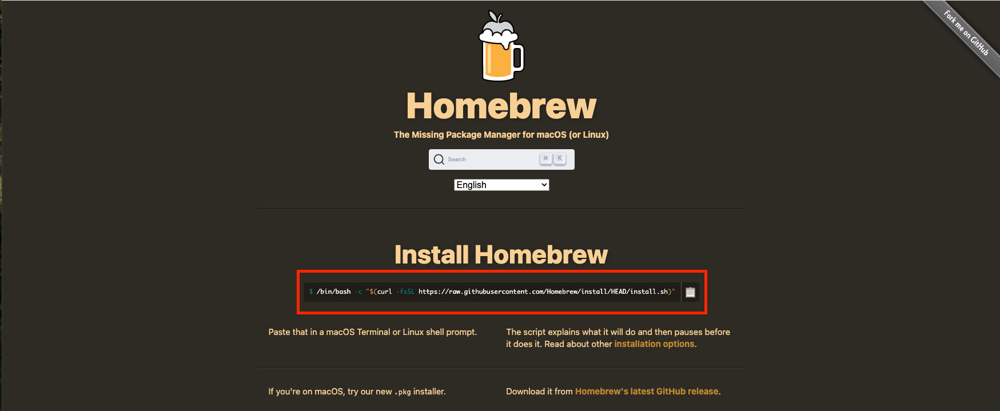

    [Homebrew Install JMeter](https://formulae.brew.sh/formula/jmeter)

    

2. Open a new Terminal Window and paste the command to install JMeter.

    ```bash
    <copy>
    brew install jmeter
    </copy>
    ```

    

    After some time the installation will conclude.

    

3. To invoke JMeter you must type and enter **jmeter** into your terminal.

    

    

## Task 1b: Setup JMeter (Windows)

1. Java JDK is required to run JMeter. Check to see if you have Java JDK already installed. Open Command Prompt, type **java -version** and hit enter on your keyboard. If you have Java installed, the command will return the java version that is installed.

    ```bash
    <copy>
    java -version
    </copy>
    ```

    

2. **(Skip if you have Java Installed)** If you do not have Java installed, navigate your web browser to [Java Downloads](https://www.oracle.com/java/technologies/downloads/#java24) and select **x64 MSI Installer**. After the file has downloaded, find it in your downloads and select run.

    *Note: The version of Java might be different, depending on when you are doing this lab*.<br/>

    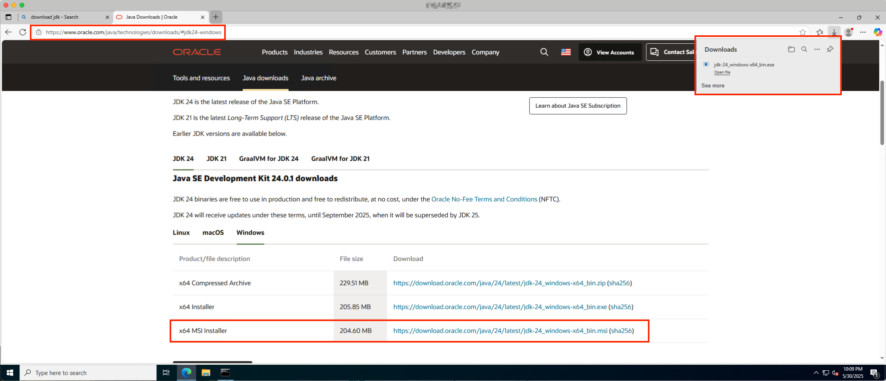

3. **(Skip if you have Java Installed)** Follow the installation prompts as the installer runs.

    

    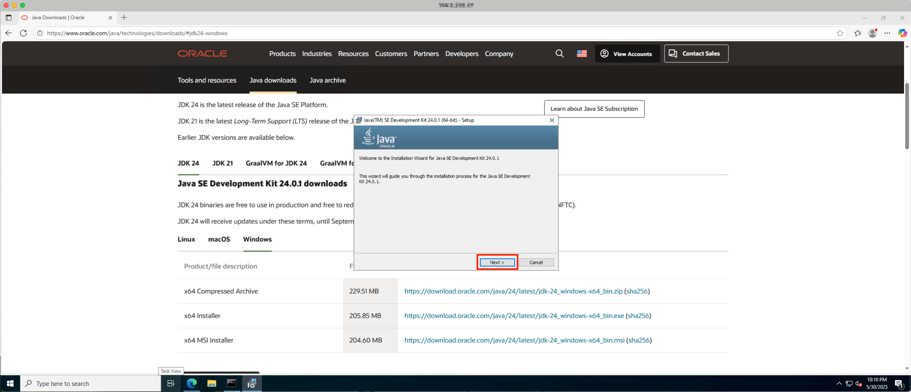

    

    

    

4. To install JMeter, navigate your web browser to [Download Apache JMeter](https://jmeter.apache.org/download_jmeter.cgi) and select **apache-jmeter-5.6.3.zip**. Once the download has completed, navigate to the location containing the compressed file on your local machine.

    *Note: The version of Apache JMeter might be different, depending on when you are doing this lab*.<br/>

    

5. Uncompress the file. You will return to this folder location in a later step.

    

    

6. The Ultimate Thread Group plugin is required for this lab and does not come preinstalled with JMeter (Windows Installation). Navigate your web browser to [Download the Plugins Manager JAR file](https://jmeter-plugins.org/get/). For more information on the Plugins Manager, you can visit [jmeter-plugins.org](https://jmeter-plugins.org/wiki/PluginsManager/).

    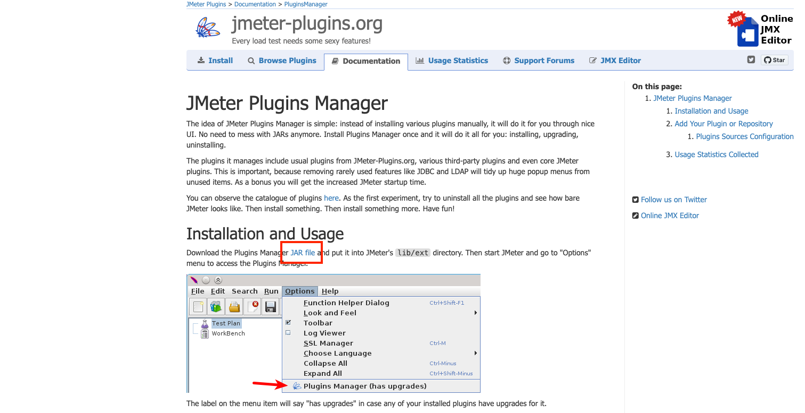

    

7. Set up two file explorer windows. One with the recently downloaded JAR file and the other with the Jmeter download. Move the JAR file into the Jmeter **lib/ext** directory.

    

8. Run JMeter by selecting the Windows Bash File **jmeter**. This is located in the **/bin** directory.

    

    

9. From the JMeter application, navigate to **Options > Plugins Manager**.

    

10. Search for **Custom Thread Group** and check the **options box** to enable the plugin.

    

## Task 1c: Alternative to JMeter (Optional)

1. If you do not wish to install JMeter. You can trigger a single dimension scaling event with a script running in Cloud Shell. If you choose to use this script, note the IP address of your load balancer as seen in **Task 2, Step 1**. In **Step 4** you will replace **your-ip-here** with your IP address.

    

2. From the OCI Console, click **Developer Tools** in the upper right corner. Select **Cloud Shell**.

    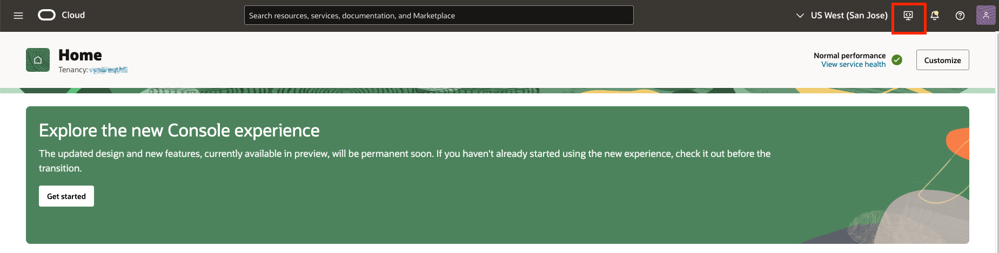

    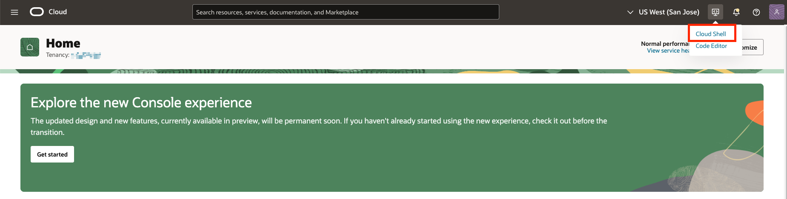

3. If you have not used Cloud Shell in a while, it may take a minute to get ready. Once Cloud Shell is ready, **paste** the scrip located in the next step and select **enter** on your keyboard for it to run. For better usability, click **Maximize** in the right corner of the Cloud Shell window.

    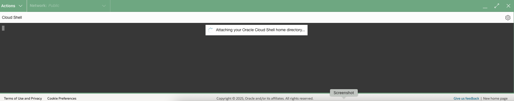

    

4. Paste the following script into Cloud Shell and select **Enter** on your keyboard. Don't forget to replace **your-ip-here** with your load balancer's public IP address.

    ```bash
    <copy>
    i=1
    while true
    do
    echo "Request $i"
        curl http://your-ip-here
        ((i++))
        echo ""  # Prints a newline for better readability between requests
    done
    </copy>
    ```

    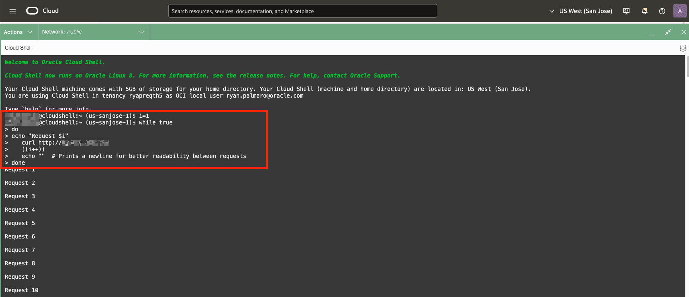

5. The script will be generating http requests to your load balancer. **Skip Task 2** and proceed directly to **Lab 5** to observe the scaling infrastructure in action. Once you are done observing the scaling event, you can stop the script by pressing **Ctrl + c** on your keyboard.

    **Note:** this script will generate a consistent amount of http requests. You will likely only see one scale out event. Once the script is no longer running, the instant count will return to one. As a result, **Lab 5** will look slightly different, but the concept remains the same.

    

## Task 2: Run JMeter

1. On the browser tab with your load balancer resource, click the **details tab** and copy your load balancer's public IP address for use in a later task.

    

2. **Click** to download the Load Test Configuration file for JMeter. It is recommended to save this file to your downloads folder.

    [Click to Download](https://ax0jeka3ncvz.objectstorage.us-sanjose-1.oci.customer-oci.com/p/-qaBiG9RoGCJqD40DVfteKTQ2HyGNIWrxDAe8bG6DNZDvJRV251UuRwPzLrVLlPT/n/ax0jeka3ncvz/b/ScaleStack/o/HTTP%20Step%20Scaling.jmx)

3. Open JMeter and load the recently downloaded .jmx file **HTTP Step Scaling**. From the JMeter application select **File** > **Open** > **Downloads** > **HTTP Step Scaling.jmx**.

    **Note:** Depending on your operating system, the steps to load the .jmx file will look slightly different, but the overall process will be similar.<br/>

    

    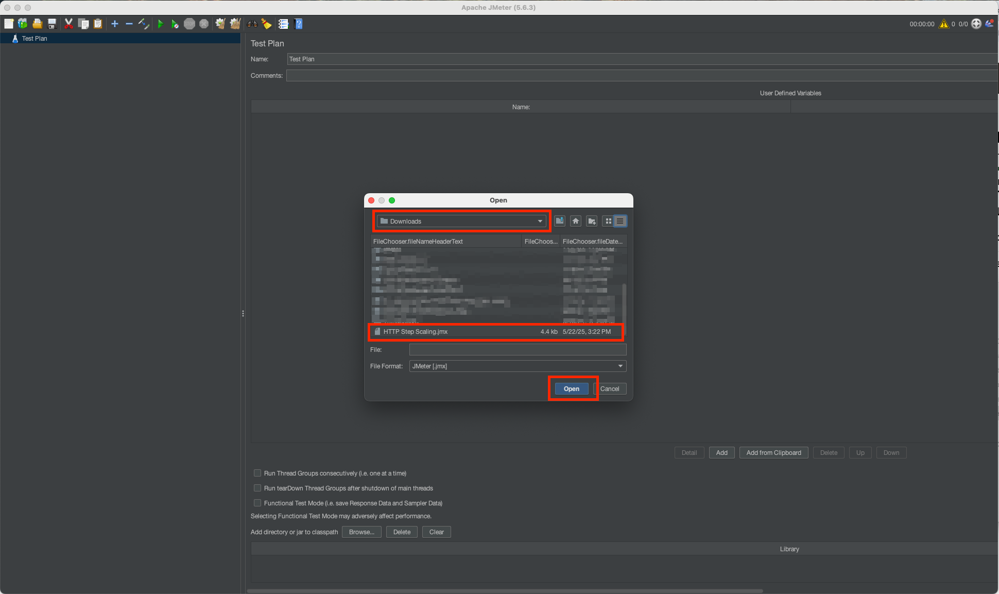

    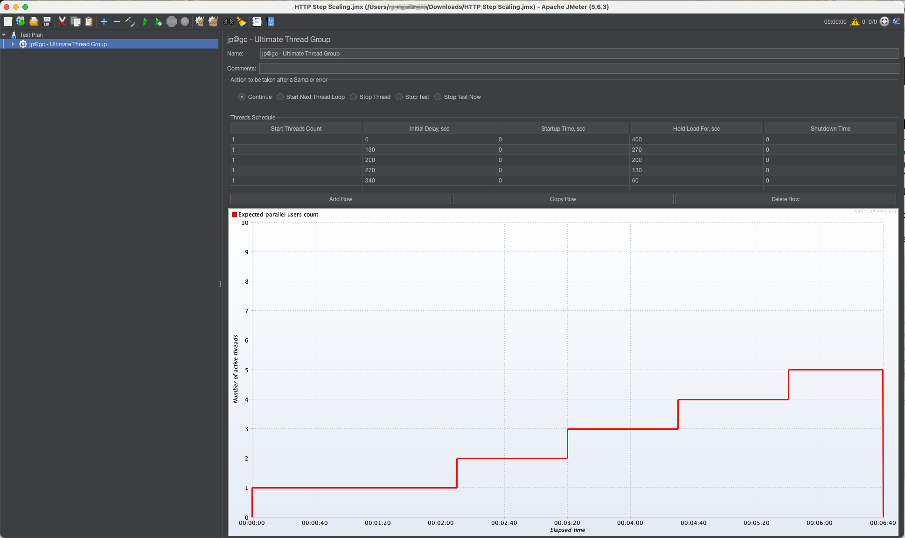

4. With the .jmx file loaded you will expand the **drop down** for the Ultimate Thread Group. Then click **HTTP request**.

    

    

    

5. Paste your load balancer's **public IP address** in the field for **Server Name or IP**.

    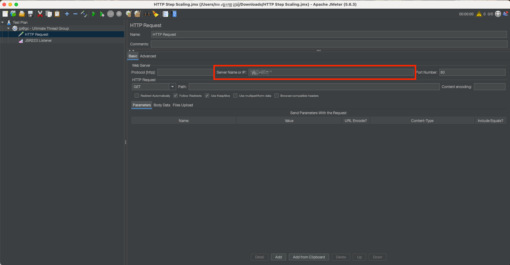

6. Click the **green play button** symbol, which will begin the http load generation.

    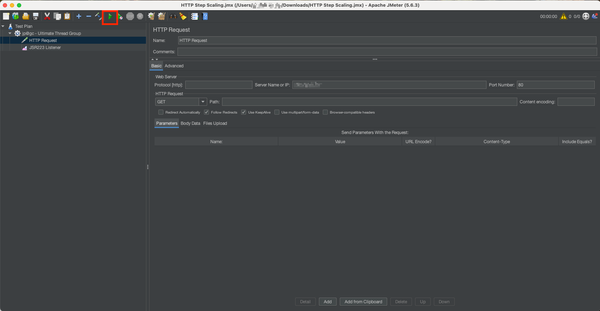

    *Congratulations! JMeter is generating http traffic to your load balancer.*<br/>
    You may now **proceed to the next lab to observe the scaling infrastructure in action**.

## Acknowledgements
* **Authors** - Ryan Palmaro and Animesh Sahay, Enterprise Cloud Architect
* **Contributor** -  Jason Yan, Enterprise Cloud Architect
* **Contributor** -  Joao Tarla, Oracle LAD A-Team Solution Engineer
* **Last Updated By/Date** - Ryan Palmaro, May 2025
