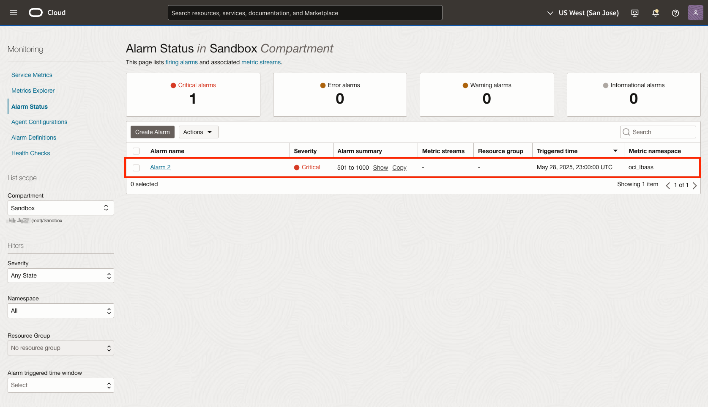
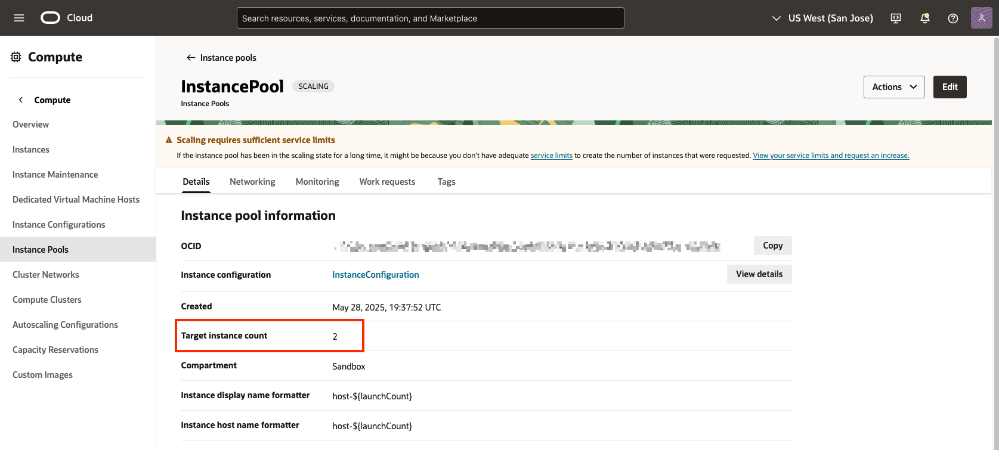
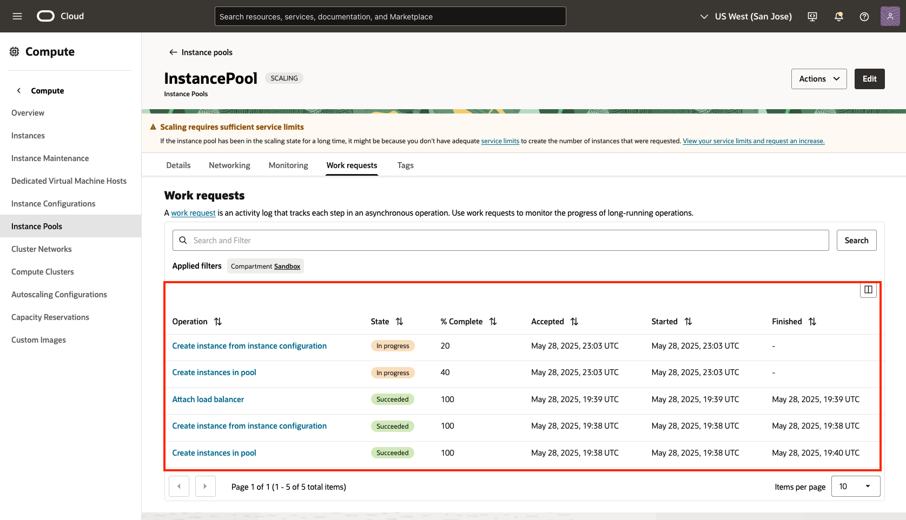
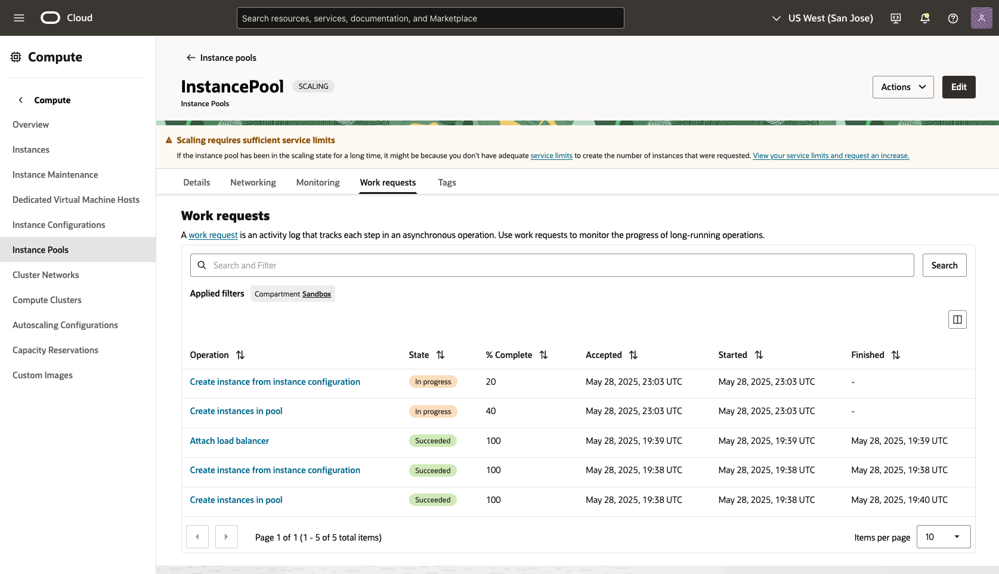
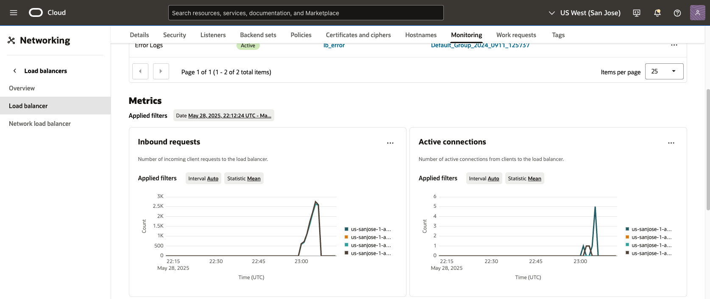
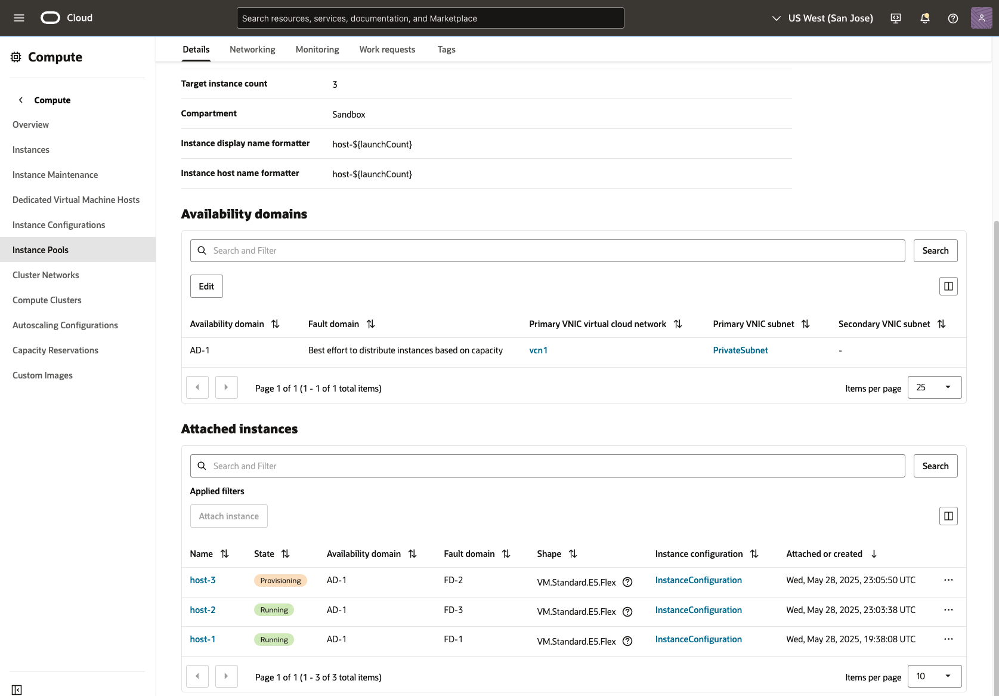
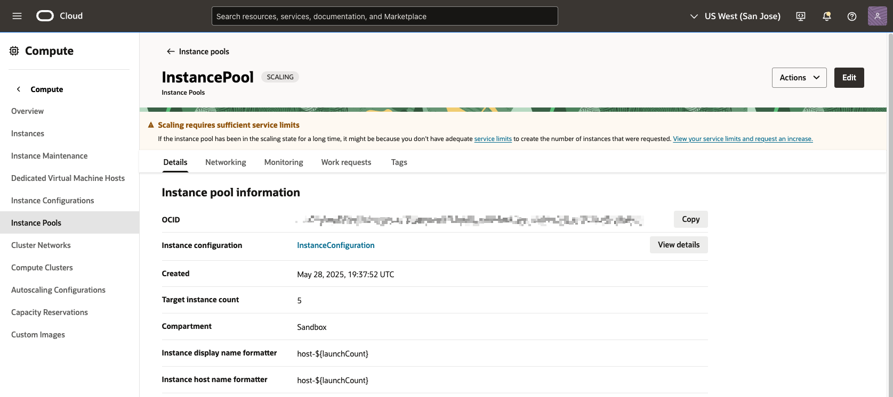
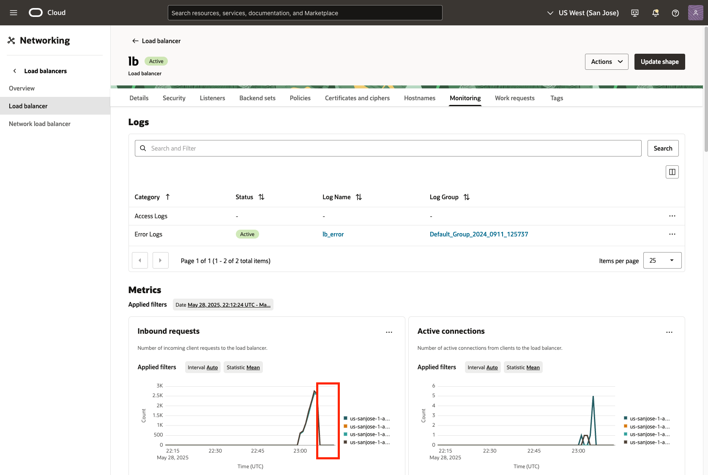
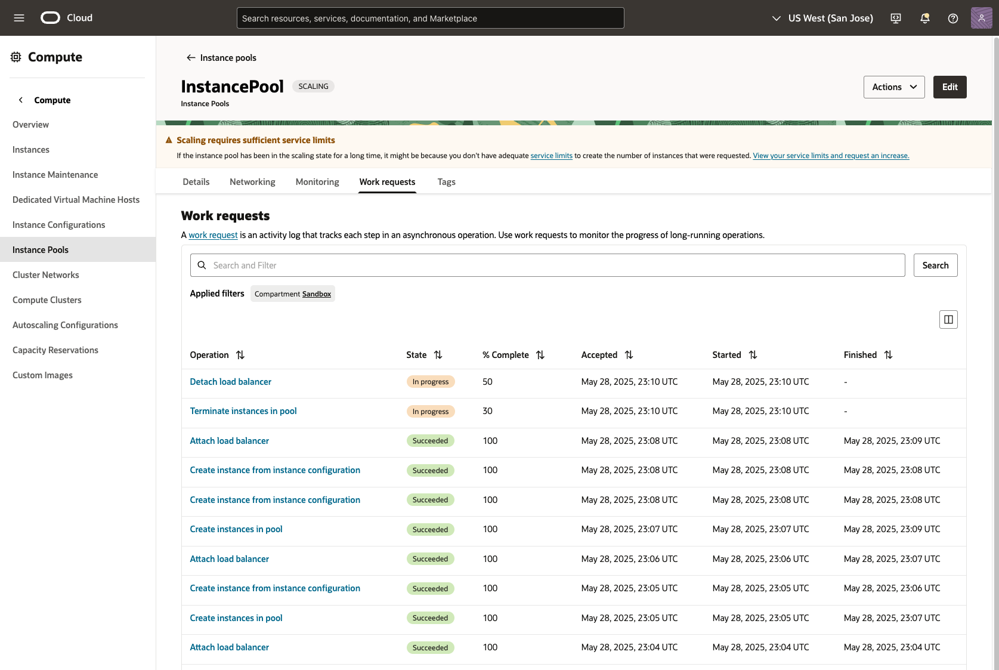

# As JMeter Generates http Traffic, Observe the Scaling Infrastructure in Action

## Introduction

In this lab you will switch between the three browser tabs opened previously in Lab 3 and observe the scaling infrastructure in action. You will notice the load balancer metrics begin to record significant http requests after approximately one minute or more has elapsed. After approximately one additional minute Alarm 2 will begin to fire. This is the result of http requests meeting the Alarm 2 trigger of 500 - 1000 http requests. Rapidly after Alarm 2 fires, the instance pool will change the target instance count value to 2 instances. Refresh your three browser tabs approximately every one to two minute to see new metrics or actions.

Estimated Time: 20 minutes

In this lab, you will better understand the following OCI resources:

* Load Balancer
* Instance Pool
* Alarms

### Prerequisites

This lab assumes you have:

* An understanding of core OCI Resources.
* Knowledge of where various resources are located in the OCI Console.

## Task 1: Cycle through the three browser tabs

1. On the browser tab with your load balancer, navigate to the **Monitoring tab** if you are not already there. Observe the quantity of Inbound requests increase. Once the request count exceeds 500, switch to the browser tab with the **alarm status** displayed.

    

    

2. On the browser tab with the **alarm status**, observe the alarm transition from Alarm 1 to Alarm 2. Once you see Alarm 2, switch to the browser with the **instance pool resource**.

    

    

3. On the browser tab with the **instance pool resource**, observe the **target instance count** transition from a value of one to two instances.

    

    

4. Click on the **work requests tab** to see the instance pool operations. Observe various operations such as, create instances in pool, create instance from configuration, attach load balancer...etc. Click on the **Details tab** to return to the previous page.

    

    

    

    

## Task 2: Repeat Task 1

1. Repeat **Task 1** and observe the scaling continue until the inbound request return to zero. **Refresh** your three browser tabs approximately every one to two minutes to see new metrics or actions. The following screen captures to provide an example of new metrics or actions.

    

    

    

    

    

    

## Task 3: Inbound request return to zero

1. The inbound requests will eventually return to zero when the JMeter load generation has concluded. Switch between your three browser tabs to observe the scaling infrastructure return to a state where there are no inbound http request.

    

    

    

    

*Congratulations! You have successfully completed the lab.* 
You may now **proceed to the next lab**.

## Acknowledgements
* **Authors** - Ryan Palmaro and Animesh Sahay, Enterprise Cloud Architect
* **Contributor** -  Jason Yan, Enterprise Cloud Architect
* **Contributor** -  Joao Tarla, Oracle LAD A-Team Solution Engineer
* **Last Updated By/Date** - Ryan Palmaro, May 2025
