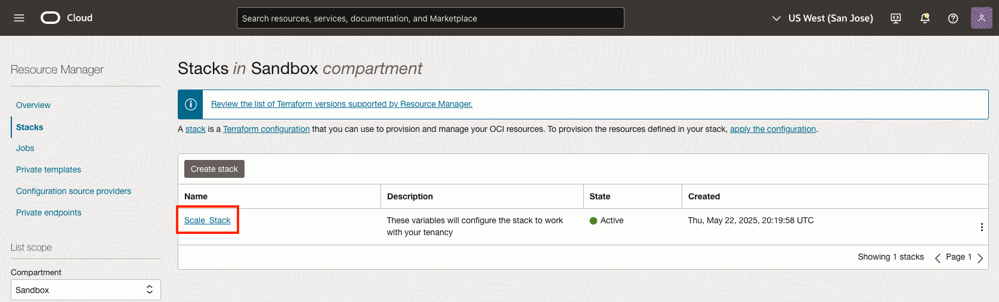

# Clean up OCI Resources

## Introduction

In this lab you will clean up the resources you created. The majority of the infrastructure you created will be deprovisioned using Terraform Destroy. The Container Registry will be manually deleted by you.

Estimated Time: 20 minutes

### Objectives

In this lab, you will learn how to:

* Destroy OCI resources using Resource Manager.
* Delete the Oracle Container Image Registry.

### Prerequisites

This lab assumes you have:

* Understanding of high level Terraform concepts.

## Task 1: Terraform Destroy

1. Navigate to OCI Resource Manager. From the **OCI Services menu**, click **Developer Services** > **Resource Manager** > **Stacks**.

    

    

2. Click the stack named **Scale_Stack**.

    

3. Click **Destroy**.

    

4. Confirm destroy by clicking **Destroy** again in the dialog box.

    

5. Observe that Resource Manager has **Accepted** the job and that the job type is **Destroy**.

    

6. Observe that the job state is now **In progress** and as the job runs, more logs will become available.

    

7. Observe that the job has **Succeeded**, and if you scroll down to the bottom of the logs, you can see that 34 resources have been destroyed.

    

## Task 2: Delete Repository

1. Navigate to your Container Registry. From the **OCI Services menu**, click **Developer Services** > **Container Registry**.

    

    

2. Click **Search for a repository or an image** and select **function-repo**.

    

    

3. Click **Delete repository** and confirm the deletion by selecting **Delete** again.

    

    

*Congratulations! You have successfully completed this workshop.* 

## Acknowledgements
* **Authors** - Ryan Palmaro and Animesh Sahay, Enterprise Cloud Architect
* **Contributor** -  Jason Yan, Enterprise Cloud Architect
* **Contributor** -  Joao Tarla, Oracle LAD A-Team Solution Engineer
* **Last Updated By/Date** - Ryan Palmaro, May 2025.
